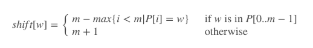

# [实现strStr()](https://leetcode-cn.com/problems/implement-strstr/)

## 题目描述

**示例 1：**

```
输入: haystack = "hello", needle = "ll"
输出: 2
```

**示例 2：**

```
输入: haystack = "aaaaa", needle = "bba"
输出: -1
```

**说明：**

当`needle`是空字符串时，我们应当返回什么值呢？这是一个在面试中很好的问题。

对于本题而言，当`needle`是空字符串时我们应当返回 0 。这与C语言的`strstr()`以及 Java的`indexOf()`定义相符。

## 解题思路

### 个人AC

声明两个游标`hc`和`nc`：

- `hc`即`haystack cursor`，用来辅助遍历字符串`haystack`；
- `nc`即`needle cursor`，用来辅助遍历字符串`needle`。

```java
class Solution {
    public int strStr(String haystack, String needle) {
        int hc = 0, nc = 0; // c即cursor，用来辅助遍历字符串
        int hLen = haystack.length(), nLen = needle.length();
        if (hLen < nLen) return -1;
        if (hLen == 0 && nLen == 0) return 0;
        
        while (hc < hLen) {
            int hRestC = hc;
            while (hRestC < hLen) {
                if (nc == nLen) return hc;
                
                char cOfH = haystack.charAt(hRestC), cOfN = needle.charAt(nc);
                if (cOfH == cOfN) {
                    hRestC++;
                    nc++;
                } else {
                    hc++;
                    nc = 0;
                    break;
                }
            }
        }
        return -1;
    }
}
```

**时间复杂度：** $O(n^2)$；

**空间复杂度：** $O(1)$。

### 最优解

#### [Sunday](https://leetcode-cn.com/problems/implement-strstr/solution/python3-sundayjie-fa-9996-by-tes/)

**Sunday匹配机制**

- 目标字符串：`haystack`或`target`；
- 模式串：`needle`或`pattern`；
- 当前查询索引：`idx`（初始为0）；
- 待匹配字符串：`target.substring(idx, idx + pattern.length())`。

每次匹配都会从**目标字符串**中提取**待匹配字符串**与**模式串**进行匹配：

- 如果匹配，则返回`idx`；

- 若不匹配，则查看**待匹配字符串**的后一位字符`c`：

  - 若`c`位于**模式串**中，则`idx = idx + 偏移表[c]`；
  - 否则，`idx = idx + pattern.length() + 1`；

  重复上述过程，直到`idx + pattern.length() > target.length()`。

**偏移表**

偏移表的作用是存储每一个在**模式串**中出现的字符和其对应的偏移位（该字符在**模式串**中出现的最右位置到尾部的位置 + 1），如**模式串`aab`**的偏移表为：

- `a`的偏移位为`pattern.length() - i = 3 - 1 = 2`；
- `b`的偏移位为`pattern.length() - i = 3 - 2 = 1`；
- 其它均为`pattern.length() + 1 = 3 + 1 = 4`。



**举例**

`target = checkthisout`，`pattern = this`。

**S1：**


- `idx = 0`，**待匹配字符串** = `chec`；
- 因为`chec != this`，所以查看`chec`下的后一个字符`k`是否在`pattern`中（查看偏移表），
- `k`不在偏移表中，所以`idx = idx + 1`。

**S2：**


- `idx = 5`，**待匹配字符串** = `this`；
- 因为`this = this`，所以返回`idx = 5`。

**实现**

```java
class Solution {
    public int strStr(String haystack, String needle) {
        int hLen = haystack.length(), nLen = needle.length();
        if (hLen < nLen) return -1;
        if (nLen == 0) return 0;
        
        // 计算偏移表
        HashMap<Character, Integer> shift = getShiftMap(needle);
        int hc = 0; // 即idx
        while (hc + nLen <= hLen) {
            // 待匹配字符串
            String subH = haystack.substring(hc, hc + nLen);
            // 判断是否匹配
            if (subH.equals(needle)) {
                return hc;
            } else {
                // 边界处理
                if (hc + nLen >= hLen) return -1;
                // 判断待匹配字符串的下一个字符是否在偏移表中
                char c = haystack.charAt(hc + nLen);
                if (shift.containsKey(c)) {
                    hc += shift.get(c);
                } else {
                    hc += nLen + 1;
                }
            }
        }
        return hc + nLen >= hLen ? -1 : hc;
    }
    
    private HashMap<Character, Integer> getShiftMap(String pattern) {
        HashMap<Character, Integer> shift = new HashMap<>();
        for (int i = 0; i < pattern.length(); i++) {
            char c = pattern.charAt(i);
            shift.put(c, pattern.length() - i);
        }
        return shift;
    }
}
```

**时间复杂度：** $O(n)$，最坏情况为$O(m * n)$，其中`n`为目标串`target`的长度，`m`为模式串`pattern`的长度；

**空间复杂度：** $O(n)$。

#### [KMP](https://leetcode-cn.com/problems/implement-strstr/solution/kmp-suan-fa-xiang-jie-by-labuladong/)