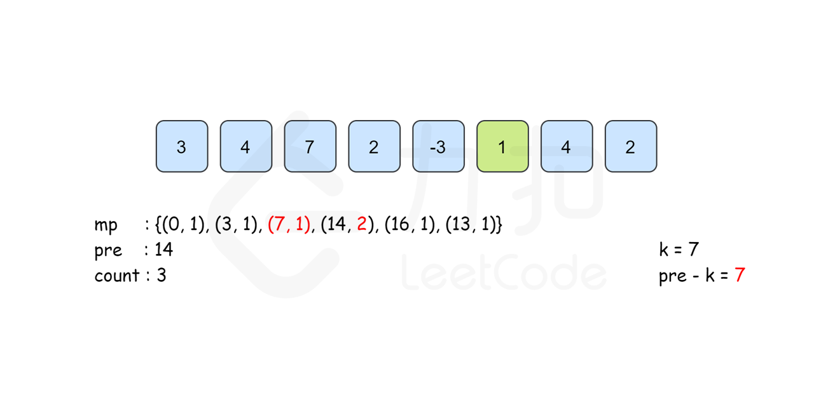

# [和为K的子数组](https://leetcode-cn.com/problems/subarray-sum-equals-k/)

## 题目描述

给定一个整数数组和一个整数 **k，**你需要找到该数组中和为 **k** 的连续的子数组的个数。

**示例 1 ：**

```
输入:nums = [1,1,1], k = 2
输出: 2 , [1,1] 与 [1,1] 为两种不同的情况。
```

**说明 ：**

1. 数组的长度为`[1, 20,000]`。
2. 数组中元素的范围是`[-1000, 1000]`，且整数 **k** 的范围是`[-1e7, 1e7]`。

## 解题思路

### 个人AC

#### 枚举

##### Golang

```go
func subarraySum(nums []int, k int) int {
    cnt := 0
    for i := 0; i < len(nums); i++ {
        sum := 0
        for j := i; j < len(nums); j++ {
            sum += nums[j]
            if sum == k {
                cnt++
            }
        }
    }
    return cnt
}
```

**时间复杂度：** $O(n^2)$；

**空间复杂度：** $O(1)$。

#### 前缀和

枚举方法中对于每一个 `i`，都需要枚举所有的 `j` 来判断是否符合条件，时间复杂度为$O(n^2)$，可以使用前缀和来“空间换时间”降低时间复杂度为$O(n)$。

定义 `pre[i]` 为 `[0...i]`里所有数的和， 则 `pre[i] = pre[i - 1] + nums[i]`，那么子数组 `[i...j]` 的和为 `k` 可以表述为 `pre[j] - pre[i - 1] = k`，即 `pre[i - 1] = pre[j] - k`，所以计算以 `j` 为结尾的和为 `k` 的连续子数组个数时统计有多少个前缀和为 `pre[j] - k` 的 `pre[i]` 即可。

建立哈希表 mp，键为前缀和，值为该前缀和出现的次数，从左向右边更新 mp 边计算答案， 那么以 `j` 结尾的前缀和 `mp[pre[j] - k]` 即可在 $O(1)$ 时间内得到。

由于 `pre[j] ` 的计算只与前一项的答案有关，因此我们不用建立 `pre`数组，直接用 `pre` 变量来记录 `pre[j - 1]`的答案即可。





##### Golang

```go
func subarraySum(nums []int, k int) int {
    count, pre := 0, 0
    m := map[int]int{}
    m[0] = 1 // 在下标0之前没有元素，可以认为前缀和为0的个数为1个
    for i := 0; i < len(nums); i++ {
        pre += nums[i] // pre[j]
        if _, ok := m[pre - k]; ok { // pre[j] - k <=> pre[i]
            count += m[pre - k]
        }
        m[pre] += 1
    }
    return count
}
```

**时间复杂度：** $O(n)$；

**空间复杂度：** $O(n)$。

### 最优解

同上。

