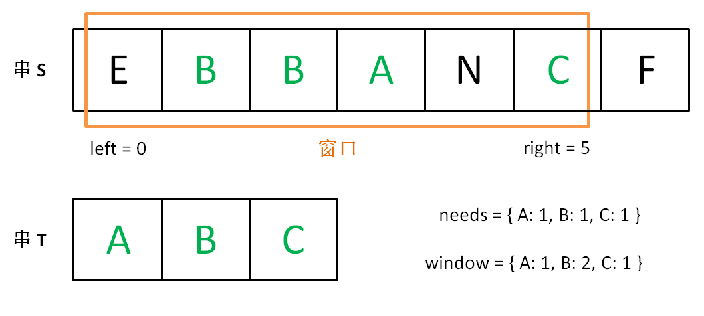

# [最小覆盖子串](https://leetcode-cn.com/problems/minimum-window-substring/)

## 题目描述

给你一个字符串 S、一个字符串 T，请在字符串 S 里面找出：包含 T 所有字母的最小子串。

**示例：**

```
输入: S = "ADOBECODEBANC", T = "ABC"
输出: "BANC"
```

**说明：**

- 如果 S 中不存这样的子串，则返回空字符串 `""`。
- 如果 S 中存在这样的子串，我们保证它是唯一的答案。

## 解题思路

### 个人AC

理解有偏差，**没有AC**。单纯地以为T中的字母不会有重复，只需要用`HashMap`来记录每个字符出现的位置即可。

```go
const (
	INT_MAX = int(^uint((0)) >> 1)
	INT_MIN = ^INT_MAX
)

func minWindow(s string, t string) string {
    mapper := make(map[int32]int)
    for _, c := range t {
        mapper[c] = -1
    }
    minLen := INT_MAX
    left, right := 0, 0
    for i, c := range s {
        _, ok := mapper[c]
        if ok {
            mapper[c] = i
            if l, r, len := coverT(mapper); len < minLen {
                left = l
                right = r
                minLen = len
            }
        }
    }
    if minLen == INT_MAX {
        return ""
    }
    return s[left : right+1]
}

func coverT(mapper map[int32]int) (int, int, int) {
    left, right := INT_MAX, INT_MIN
    for _, v := range mapper {
        if v < 0 {
            return INT_MAX, INT_MIN, INT_MAX
        }
        if left > v {
            left = v
        }
        if v > right {
            right = v
        }
    }
    return left, right, right - left + 1
}
```

执行结果：解答错误。

**输入：**

```
"a"
"aa"
```

**输出：**

```
"a"
```

**预期结果：**

```
""
```

### 最优解

#### 滑动窗口

**参考自：**[leetcode-cn题解 滑动窗口算法通用思想](https://leetcode-cn.com/problems/minimum-window-substring/solution/hua-dong-chuang-kou-suan-fa-tong-yong-si-xiang-by-/)

思路：

1. 在字符串`s`中使用双指针中的左右指针技巧，初始化`left = right = 0`，把索引区间`[left, right]`称为一个窗口；
2. 先不断地向右移动`right`指针，扩大窗口，直到窗口中的字符串符合要求（包含了`t`中的所有字符）；
3. 此时，停止移动`right`，转而不断移动`left`指针缩小窗口，直到窗口中的字符串不再符合要求（不包含`t`中的所有字符），每次增加`left`时，都要更新一轮内容；
4. 重复第`2`和`3`步，直到`right`到达字符串`s`的末尾。

本质：第`2`步相当于寻找一个“可行解”，第`3`步相当于优化这个“可行解“，最终找到最优解。

---

`needs`和`window`相当于计数器，分别记录`t`中字符出现次数和窗口中的相应字符的出现次数。

初始状态：


移动`right`，直到窗口`[left, right]`包含了`t`中所有字符：



然后移动`left`，缩小窗口`[left, right]`：


直到窗口中的字符串不再符合要求，`left`不再继续移动：


之后重复上述过程，先移动`right`，再移动`left`…… 直到`right`指针到达字符串`s`的末尾，算法结束。

上述过程可以简单地写出如下伪码框架：

```java
string s, t;
// 在 s 中寻找 t 的「最小覆盖子串」
int left = 0, right = 0;
string res = s;

while(right < s.size()) {
    window.add(s[right]);
    right++;
    // 如果符合要求，移动 left 缩小窗口
    while (window 符合要求) {
        // 如果这个窗口的子串更短，则更新 res
        res = minLen(res, window);
        window.remove(s[left]);
        left++;
    }
}
return res;
```

如何判断`window`即子串`s[left:right+1]`是否包含`t`的所有字符呢？

可以用两个哈希表当作计数器解决。用一个哈希表`needs`记录字符串`t`中包含的字符及出现次数，用另一个哈希表`window`记录当前窗口`[left, right]`中包含的字符及出现的次数，如果`window`包含所有`needs`中的键，且这些键对应的值都大于等于`needs`中的值，那么就可以知道当前窗口`[left, right]`符合要求了，然后可以移动`left`指针了。

##### Java

```java
class Solution {
    public String minWindow(String s, String t) {
        // 记录最短子串的开始位置和长度，即覆盖最小子串的窗口
        int minLeft = 0, minLen = Integer.MAX_VALUE;
        // 当前窗口
        int left = 0, right = 0;
        
    	HashMap<Character, Integer> needs = new HashMap<Character, Integer>() {{
           for (int i = 0; i < t.length(); i++) {
               char key = t.charAt(i);
               this.put(key, this.getOrDefault(key, 0) + 1);
           }
        }};
        HashMap<Character, Integer> window = new HashMap<>();
        
        int match = 0;
        while (right < s.length()) {
            char c = s.charAt(right);
            if (needs.containsKey(c)) {
                window.put(c, window.getOrDefault(c, 0) + 1);
                // 常量池 -128 ~ 127，若不手动拆箱，当字符串过长时会出现问题
                if (window.get(c).intValue() == needs.get(c).intValue()) {
                    match++;
                }
            }
            right++;
            
            // 不断移动right指针，直到找到包含t中所有字母的子串
            // 然后移动左指针，优化当前解
            while (match == needs.size()) {
                if (right - left < minLen) {
                    // 更新最小子串的开始位置和长度
                    minLeft = left;
                    minLen = right - left;
                }
                
                c = s.charAt(left);
                if (needs.containsKey(c)) {
                    window.put(c, window.get(c) - 1);
                    if (window.get(c) < needs.get(c)) {
                        // 字符c的出现次数不再符合要求
                        match--;
                    }
                }
                left++;
            }
        }
        return minLen == Integer.MAX_VALUE ? "" : s.substring(minLeft, minLeft + minLen);
    }
}
```

##### Golang

```go
const (
	INT_MAX = int(^uint((0)) >> 1)
	INT_MIN = ^INT_MAX
)

func minWindow(s string, t string) string {
    // 记录最短子串的开始位置和长度，即覆盖最小子串的窗口
    minWindowLeft, minWindowLen := 0, INT_MAX
    // 当前窗口
    left, right := 0, 0
    needs := make(map[int32]int)
    for _, c := range t {
        needs[c]++
    }
    window := make(map[int32]int)
    match := 0
    for _, c := range s {
        if _, ok := needs[c]; ok {
            window[c]++
            if window[c] == needs[c] {
                match++
            }
        }
        right++
        
        for match == len(needs) {
            if right - left < minWindowLen {
                minWindowLeft = left
                minWindowLen = right - left
            }
            c = int32(s[left])
            if _, ok := needs[c]; ok {
                window[c]--
                if window[c] < needs[c] {
                    match--
                }
            }
            left++
        }
        
    }
    if minWindowLen == INT_MAX {
        return ""
    } else {
        return s[minWindowLeft: minWindowLeft + minWindowLen]
    }
}
```


**时间复杂度：** $O(m + n)$，其中`m`和`n`分别是字符串`s`和`t`的长度；

**空间复杂度：** $O(m)$；

## 举一反三

1. [LeetCode 0003 -- 无重复字符的最长子串](https://leetcode-cn.com/problems/longest-substring-without-repeating-characters/)；
2. [LeetCode 0438 -- 找到字符串中所有字母异位词](https://leetcode-cn.com/problems/find-all-anagrams-in-a-string/)；