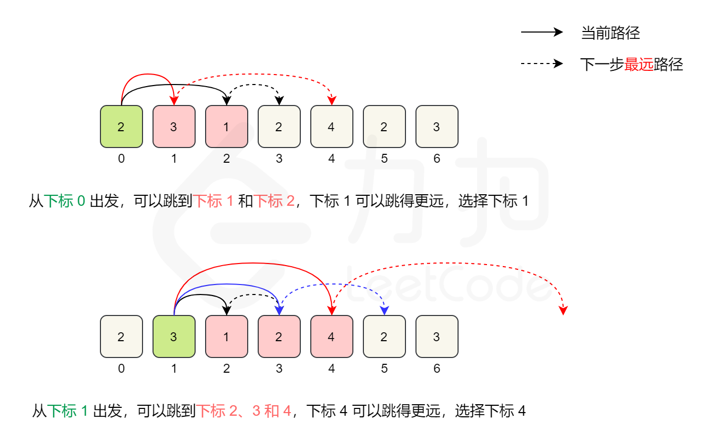

# [跳跃游戏II](https://leetcode-cn.com/problems/jump-game-ii/)

## 题目描述

给定一个非负整数数组，你最初位于数组的第一个位置。

数组中的每个元素代表你在该位置可以跳跃的最大长度。

你的目标是使用最少的跳跃次数到达数组的最后一个位置。

**示例：**

```
输入: [2,3,1,1,4]
输出: 2
解释: 跳到最后一个位置的最小跳跃次数是 2。
     从下标为 0 跳到下标为 1 的位置，跳 1 步，然后跳 3 步到达数组的最后一个位置。
```

**说明：**

假设你总是可以到达数组的最后一个位置。

## 解题思路

### 个人AC

#### 贪心

##### Golang

**正向查找，每次找到可到达的最远位置，就可以在线性时间内得到最少的跳跃次数。**



在具体的实现中，我们维护当前能够到达的最大下标位置，记为边界。我们从左到右遍历数组，到达边界时，更新边界并将跳跃次数增加 1。

在遍历数组时，我们不访问最后一个元素，这是因为在访问最后一个元素之前，我们的边界一定大于等于最后一个位置，否则就无法跳到最后一个位置了。如果访问最后一个元素，在边界正好为最后一个位置的情况下，我们会增加一次「不必要的跳跃次数」，因此我们不必访问最后一个元素。

```go
func jump(nums []int) int {
    length := len(nums)
    steps := 0
    maxPosition := 0
    end := 0
    for i := 0; i < length - 1; i++ {
        // 每走一步，都计算一下当前能够到达的最远距离
        if i + nums[i] > maxPosition {
            maxPosition = i + nums[i]
        }
        // 达到边界时，更新边界并将跳跃次数增加 1
        if i == end {
            end = maxPosition
            steps++
        }
    }
    return steps
}
```

**时间复杂度：** $O(n)$；

**空间复杂度：** $O(1)$。

### 最优解

同上。