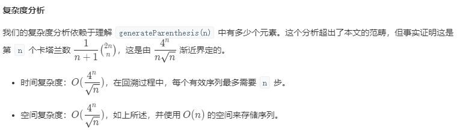

# [括号生成](https://leetcode-cn.com/problems/generate-parentheses/)

## 题目描述

给出 *n* 代表生成括号的对数，请你写出一个函数，使其能够生成**所有可能**的并且**有效的**括号组合。

例如，给出 *n* = 3，生成结果为：

```
[
  "((()))",
  "(()())",
  "(())()",
  "()(())",
  "()()()"
]
```

## 解题思路

### 个人AC

回溯算法可以用来穷尽复杂、递归问题的所有解。一般地，当遇到需要求出**所有可能解**的问题时，可以考虑从回溯（DFS）思想入手。

可以很容易地得出，递归深度`depth`跟括号对数`n`有关：`depth = 2 * n`。

如果不考虑**“有效性”**而只考虑左右括号数量对等的话，一共有$C_{2n}^{n}$种括号组合：

- 当`(`或`)`的数量超过`n+1`时，需要直接跳过。

```java
class Solution {
    
    public List<String> generateParenthesis(int n) {
        HashMap<Character, Integer> braces = new HashMap<Character, Integer>() {{
            put('(', n);
            put(')', n);
        }};
        
        List<String> output = new ArrayList<>();
        backtrace(output, braces, "", 2 * n, 1);
        return output;
    }
    
    /**
      * @param restBraces:HashMap<Character, Integer>    剩余的括号数量
      * @param possible:String                           表示一种可能的解
      * @param n:int                                     最大递归深度
      * @param depth:int                                 递归深度
      */
    private void backtrace(List<String> output, HashMap<Character, Integer> restBraces, String possible, int n, int depth) {
        if (depth > n) {
            output.add(possible);
            return;
        }
        
        for (char brace : restBraces.keySet()) {
            if (restBraces.get(brace) <= 0) continue;
            restBraces.put(brace, restBraces.get(brace) - 1);
            backtrace(output, restBraces, possible + brace, n, depth + 1);
            
            // backtrace
            restBraces.put(brace, restBraces.get(brace) + 1);
        }
    }
}
```

但若要考虑**“有效性”**的话，则需要从所有可能中剔除**无效组合**（剪枝）。那么什么样的情况是无效的呢？

- 如果当前附加的字符为`(`的话：
  - 直接DFS就可以了~~
- 如果当前附加的字符为`)`的话：
  - 其左边`(`的数量等于`)`的数量，即加上当前的`)`会产生失衡，如`())`，直接跳过；

```java
class Solution {
    
    public List<String> generateParenthesis(int n) {
        HashMap<Character, Integer> braces = new HashMap<Character, Integer>() {{
            put('(', n);
            put(')', n);
        }};
        
        List<String> output = new ArrayList<>();
        backtrace(output, braces, "", 2 * n, 1);
        return output;
    }
    
    /**
      * @param restBraces:HashMap<Character, Integer>    剩余的括号数量
      * @param possible:String                           表示一种可能的解
      * @param n:int                                     最大递归深度
      * @param depth:int                                 递归深度
      */
    private void backtrace(List<String> output, HashMap<Character, Integer> restBraces, String possible, int n, int depth) {
        if (depth > n) {
            output.add(possible);
            return;
        }
        
        for (char brace : restBraces.keySet()) {
            if (restBraces.get(brace) <= 0) continue;
            if (brace == ')' && (restBraces.get('(') == restBraces.get(')'))) {
                continue;
            }
            restBraces.put(brace, restBraces.get(brace) - 1);
            backtrace(output, restBraces, possible + brace, n, depth + 1);
            
            // backtrace
            restBraces.put(brace, restBraces.get(brace) + 1);
        }
    }
}
```

难受啊，为什么只击败了10 ~ 20%的提交啊~~还有什么地方可以优化的么？


### 最优解

只有在我们知道序列仍然保持有效时才添加 `'('` or `')'`。我们可以通过跟踪到目前为止放置的左括号和右括号的数目来做到这一点。

- 如果我们`(`没有放完，我们可以放一个`(`；
- 如果`)`的数量不超过`(`的数量，我们可以放一个`)`。

```java
class Solution {
    public List<String> generateParenthesis(int n) {
        List<String> output = new ArrayList();
        backtrack(output, "", 0, 0, n);
        return output;
    }

    public void backtrack(List<String> output, String possible, int open, int close, int max){
        if (possible.length() == max * 2) {
            output.add(possible);
            return;
        }

        if (open < max)
            backtrack(output, possible + "(", open + 1, close, max);
        if (close < open)
            backtrack(output, possible + ")", open, close + 1, max);
    }
}
```

