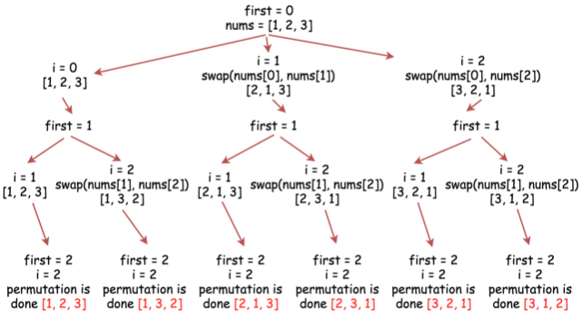

# [全排列](https://leetcode-cn.com/problems/permutations/)

## 题目描述

给定一个**没有重复**数字的序列，返回其所有可能的全排列。

**示例：**

```
输入: [1,2,3]
输出:
[
  [1,2,3],
  [1,3,2],
  [2,1,3],
  [2,3,1],
  [3,1,2],
  [3,2,1]
]
```

## 解题思路

### 个人AC

没有思路QAQ。

### 最优解

回溯算法是一种尝试探索所有可能的候选解来找出所有解的算法。如果候选解被确认“不是一个解（或至少不是最后一个解）”，就回溯到上一个“回溯点”进行一些变化后再次尝试。



```java
class Solution {
    public List<List<Integer>> permute(int[] nums) {
        List<List<Integer>> output = new LinkedList<>();
        backtrace(output, nums, 0);
        return output;
    }

    private void backtrace(List<List<Integer>> output, int[] nums, int first) {
        if (first == nums.length - 1) {
            List<Integer> inner = new ArrayList<>();
            for (int num : nums) {
                inner.add(num);
            }
            output.add(inner);
            return;
        }

        for (int i = first; i < nums.length; i++) {
            swap(nums, i, first);
            backtrace(output, nums, first + 1);
            swap(nums, i, first);
        }
    }

    private void swap(int[] nums, int i, int j) {
        int tmp = nums[i];
        nums[i] = nums[j];
        nums[j] = tmp;
    }
}
```

**时间复杂度：** $O(A^{n}_{n})$；

**空间复杂度：** $O(nA^{n}_{n})$。