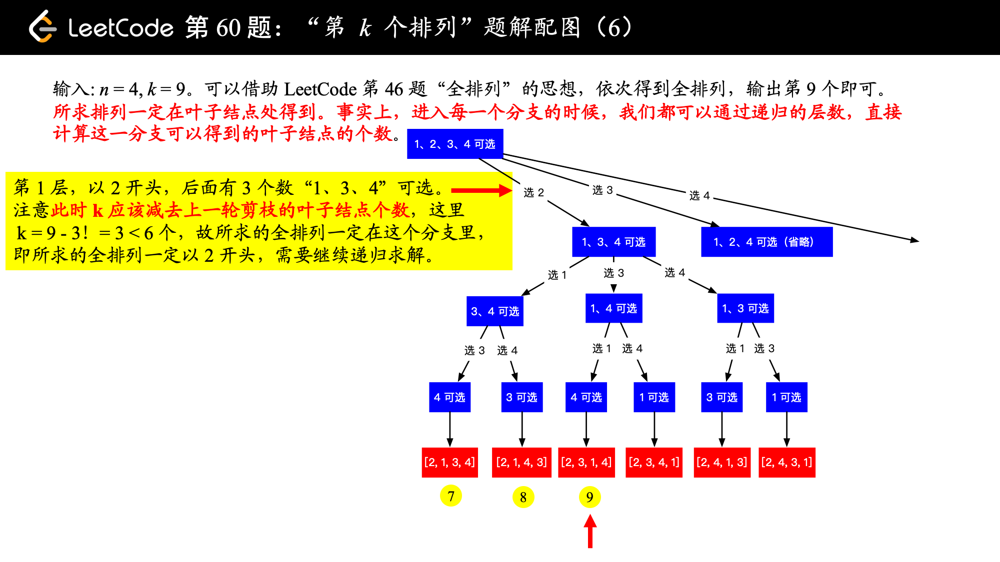

# [第K个排列](https://leetcode-cn.com/problems/permutation-sequence/)

## 题目描述

给出集合`[1,2,3,…,n]`，其所有元素共有`n!`种排列。

按大小顺序列出所有排列情况，并一一标记，当`n = 3`时, 所有排列如下：

```
"123"
"132"
"213"
"231"
"312"
"321"
```

给定`n`和`k`，返回第`k`个排列。

**说明：**

- 给定`n`的范围是`[1, 9]`。
- 给定`k`的范围是`[1,  n!]`。

**示例 1：**

```
输入: n = 3, k = 3
输出: "213"
```

**示例 2：**

```
输入: n = 4, k = 9
输出: "2314"
```

## 解题思路

### 个人AC

```java
class Solution {
    public String getPermutation(int n, int k) {
        char[] chs = new char[n];
        boolean[] used = new boolean[n];
        backtrack(n, chs, used, 0, k);
        return new String(chs);
    }
    
    private void backtrack(int n, char[] chs, boolean[] used, int depth, int k) {
        if (depth == n) {
            return;
        }
        int subLen = factorial(n - 1 - depth);
        for (int i = 0; i < n; i++) {
            if (used[i]) {
                continue;
            }
            if (subLen < k) {
                k -= subLen;
                continue;
            }
            chs[depth] = (char)(i + '1');
            used[i] = true;
            backtrack(n, chs, used, depth + 1, k);
            break;
        }
    }
    
    // 求 n!
    private int factorial(int n) {
        int res = 1;
        while (n > 1) {
            res *= n--;
        }
        return res;
    }
}
```

### 最优解（回溯 + 剪枝）

比较容易想到的是，使用同 「力扣」第 46 题：全排列 ，即使用回溯的思想，依次得到全排列，输出所求的第 k 个全排列即可。但事实上，我们不必求出所有的全排列。基于以下几点考虑：

1、我们知道所求排列一定在叶子结点处得到。事实上，进入每一个分支的时候，我们都可以通过递归的层数，直接计算这一分支可以得到的叶子结点的个数。

这是因为：进入一个分支的时候，我们可以根据已经选定的数的个数，进而确定还未选定的数的个数，然后计算阶乘，就知道这一个分支的叶子结点有多少个。

2、如果 k 大于这一个分支将要产生的叶子结点数，直接跳过这个分支，即“剪枝”即可。

这是因为：即使你回溯去做，要设置状态，回溯回来的时候状态还要重置，但其实跳过的这个分支的叶子结点具体是啥我们并不关心。

3、如果 k 小于等于这一个分支将要产生的叶子结点数，那说明所求的全排列一定在这一个分支将要产生的叶子结点里，需要递归求解。

4、计算阶乘的时候，你可以使用循环计算，特别注意：0!=1，它表示了没有数可选的时候，即表示到达叶子结点了，排列数只剩下 1 个。

又因为题目中说“给定 n 的范围是 [1, 9]”，故可以实现把从 0 到 9 的阶乘计算好，放在一个数组里，可以根据索引直接获得阶乘值。

下面以示例 2：输入: n = 4，k = 9，介绍如何使用“回溯 + 剪枝” 的思想得到输出 "2314"。





```java
import java.util.ArrayList;
import java.util.List;

public class Solution {

    public String getPermutation(int n, int k) {
        int[] nums = new int[n];
        boolean[] used = new boolean[n];
        for (int i = 0; i < n; i++) {
            nums[i] = i + 1;
            used[i] = false;
        }
        List<String> pre = new ArrayList<>();
        return dfs(nums, used, n, k, 0, pre);
    }

    private int factorial(int n) {
        // 这种编码方式包括了 0 的阶乘是 1 这种情况
        int res = 1;
        while (n > 0) {
            res *= n;
            n -= 1;
        }
        return res;
    }

    private String dfs(int[] nums, boolean[] used, int n, int k, int depth, List<String> pre) {
        if (depth == n) {
            StringBuilder sb = new StringBuilder();
            for (String c : pre) {
                sb.append(c);
            }
            return sb.toString();
        }
        int ps = factorial(n - 1 - depth);
        for (int i = 0; i < n; i++) {
            if (used[i]) {
                continue;
            }
            if (ps < k) {
                k -= ps;
                continue;
            }
            pre.add(nums[i] + "");
            used[i] = true;
            return dfs(nums, used, n, k, depth + 1, pre);
        }
        // 如果参数正确的话，代码不会走到这里
        throw new RuntimeException("参数错误");
    }
}
```


时间复杂度： $O(n^2)$；

空间复杂度： $O(n)$。

