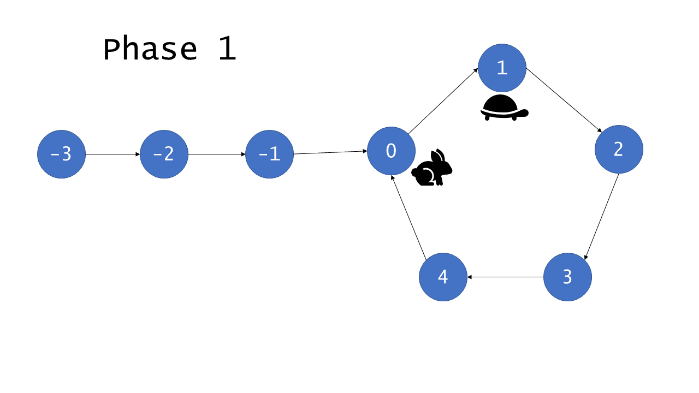

# [环形链表II](https://leetcode-cn.com/problems/linked-list-cycle-ii/)

## 题目描述

给定一个链表，返回链表开始入环的第一个节点。 如果链表无环，则返回 null。

为了表示给定链表中的环，我们使用整数 pos 来表示链表尾连接到链表中的位置（索引从 0 开始）。 如果 pos 是 -1，则在该链表中没有环。

说明：不允许修改给定的链表。

**示例 1：**

```
输入：head = [3,2,0,-4], pos = 1
输出：tail connects to node index 1
解释：链表中有一个环，其尾部连接到第二个节点。
```


**示例 2：**

```
输入：head = [1,2], pos = 0
输出：tail connects to node index 0
解释：链表中有一个环，其尾部连接到第一个节点。
```


**示例 3：**

```
输入：head = [1], pos = -1
输出：no cycle
解释：链表中没有环。
```


## 解题思路

### 个人AC

借助HashSet，遍历链表，找到第一个重复的结点。

```java
/**
 * Definition for singly-linked list.
 * class ListNode {
 *     int val;
 *     ListNode next;
 *     ListNode(int x) {
 *         val = x;
 *         next = null;
 *     }
 * }
 */
public class Solution {
    public ListNode detectCycle(ListNode head) {
        HashSet<ListNode> set = new HashSet<>();
        
        while (head != null) { // 如果链表是循环的，则该while循环只能从内部打破
            if (set.contains(head)) {
                return head;
            }
            set.add(head);
            head = head.next;
        }
        // 否则while正常结束，说明链表无环，返回null
        return null;
    }
}
```

**时间复杂度：** $O(n)$，因为HashSet底层是HashMap，存在扩容rehash的过程，所以复杂度可能达到$O(n^2)$；

**空间复杂度：** $O(n)$，借助了HashSet作为辅助容器。

### [最优解](https://leetcode-cn.com/problems/linked-list-cycle-ii/solution/huan-xing-lian-biao-ii-by-leetcode/)

#### Floyd算法

Floyd算法分为两个阶段：

- 在第一阶段，借助**快慢指针找出列表中是否有环**，如果没有环，可以直接返回`null`并退出，如果有环，则快慢指针会在某点相遇；
- 在第二阶段，通过上一阶段找到的相遇结点来找到环的入口。

*阶段 1*

这里我们初始化两个指针 - 快指针和慢指针。我们每次移动慢指针一步、快指针两步，直到快指针无法继续往前移动。如果在某次移动后，快慢指针指向了同一个节点，我们就返回它。否则，我们继续，直到 while 循环终止且没有返回任何节点，这种情况说明没有成环，我们返回 null 。

下图说明了这个算法的工作方式：


环中的节点从 0 到 C-1编号，其中 C 是环的长度。非环节点从 -F 到 -1 编号，其中 F 是环以外节点的数目。 F 次迭代以后，慢指针指向了 0 且快指针指向某个节点 h ，其中 F≡h(modC) 。这是因为快指针在 F 次迭代中遍历了 2F 个节点，且恰好有 F 个在环中。继续迭代 C-h 次，慢指针显然指向第 C-h 号节点，而快指针也会指向相同的节点。原因在于，快指针从 h 号节点出发遍历了 2(C-h) 个节点。

	   h + 2(C-h) = 2C - h
				  ≡ C−h(modC)

```
“≡”是数论中表示同余的符号（注意！！这个不是恒等号），

同余的定义是这样的:

给定一个正整数n，如果两个整数a和b满足a-b能被n整除，即(a-b)modn=0，那么就称整数a与b对模n同余，记作a≡b(modn)，同时可成立amodn=b。

也就是相当于a被n整除余数等于b的意思。
```

因此，如果列表是有环的，快指针和慢指针最后会同时指向同一个节点，因此被称为 *相遇* 。

*阶段 2*

给定阶段 1 找到的相遇点，阶段 2 将找到环的入口。首先我们初始化额外的两个指针： ptr1 ，指向链表的头， ptr2 指向相遇点。然后，我们每次将它们往前移动一步，直到它们相遇，它们相遇的点就是环的入口，返回这个节点。

下面的图将更好的帮助理解和证明这个方法的正确性。


我们利用已知的条件：慢指针移动 1 步，快指针移动 2 步，来说明它们相遇在环的入口处。（下面证明中的 tortoise 表示慢指针，hare 表示快指针）


因为 F=b，指针从 h 点出发和从链表的头出发，最后会遍历相同数目的节点后在环的入口处相遇。

下面的动画中动态地演示了整个算法过程：





```java
/**
 * Definition for singly-linked list.
 * class ListNode {
 *     int val;
 *     ListNode next;
 *     ListNode(int x) {
 *         val = x;
 *         next = null;
 *     }
 * }
 */
public class Solution {
    public ListNode detectCycle(ListNode head) {
        if (null == head) return null;
        
        ListNode intersect = getIntersect(head);
        if (null == intersect) {
            return null;
        }
        
        ListNode ptr1 = head, ptr2 = intersect;
        while (ptr1 != ptr2) {
            ptr1 = ptr1.next;
            ptr2 = ptr2.next;
        }
        return ptr1;
    }
    
    private ListNode getIntersect(ListNode head) {
        ListNode slow = head, fast = head;
        while (fast != null && fast.next != null) {
            slow = slow.next;
            fast = fast.next.next;
            if (slow == fast) return slow;
        }
        return null;
    }
}
```

**时间复杂度：** $O(n)$；

**空间复杂度：** $O(1)$。

