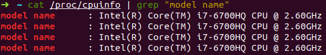
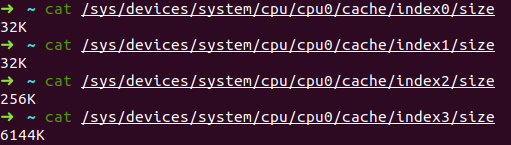
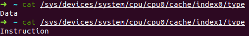
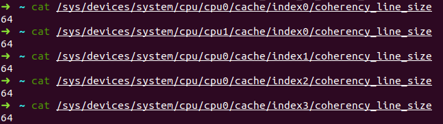
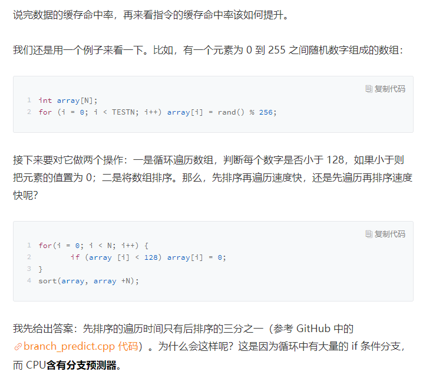
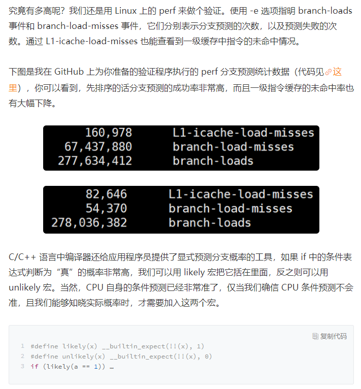

# CPU缓存与性能优化

> 如何通过提升CPU缓存的命中率来优化程序的性能？

CPU缓存由更快的SRAM构成（内存由DRAM构成），而且离CPU核心更近，如果运算时需要的数据是从CPU缓存读取，而不是从内存中读取，运算速度就会快很多。

> RAM（Random Access Memory，随机存储器）主要的作用是储存代码和数据供CPU在需要的时候调用，可分为SRAM（Static Random Access Memory，静态随机存取存储器）和DRAM（Dynamic Random Access Memory，动态随机存取存储器）。
>
> “静态”是指不需要动态刷新电路以保持数据。SRAM使用4-6个晶体管存储一个bit，而DRAM只需要使用1个晶体管和1个电容就可以存储一个bit。DRAM进行读操作时会将电容与外界形成回路，通过检查电荷的流向来判断是1还是0（电荷从电容中流出为1，电荷流入到电容中为0），但电容中的电荷会随时间的变化逐渐流失，因此需要周期性地刷新电路。
>
> SRAM不需要刷新电路就可以保存内部的数据，所以具有更好的性能。
>
> 但是正因为SRAM比DRAM使用更多的晶体管，所以相同容量的SRAM体积要比DRAM更大，即集成度更低，功耗也更大。
>
> 综上所述，SRAM不需要周期性刷新电路，读写速度更快，但集成度低、功耗高、生产成本高，多用于容量较小的高速缓冲存储器；DRAM需要周期性刷新电路，读写速度慢，但集成度高、功能低、生产成本低，多用于容量较大的主存储器。

优化越接近底层，适用范围越广，效果也越明显。理解CPU缓存的运行机制并编写顺应其工作方式代码，能够有效提升代码运行速度。

## CPU的多级缓存

由于电子信号传输是需要时间的，离CPU核心越近，缓存的读写速度就越快。但CPU空间极小，所以离CPU越近缓存大小受到的限制也越大。所以，综合硬件布局、性能等因素，CPU缓存通常分为大小不等的三级缓存。

查看CPU缓存大小：





三级缓存要比一、二级缓存大很多倍。每个CPU核心都有自己的一、二级缓存，但三级缓存却是一颗CPU上所有核心共享的。

程序执行时，会先将内存中的数据加载到共享的三级缓存中，再进入每个核心独享的二级缓存，最后进入最快的一级缓存（一级缓存有两个：一级数据缓存和一级指令缓存，如上图的index0和index1），之后才会被CPU使用。



缓存通常要比内存快很多。CPU访问一次内存通常需要100个时钟周期以上，而访问一级缓存只需要4~5个时钟周期，二级缓存需要12个时钟周期，三级缓存大约需要30个时钟周期。

> 对于2GHz主频的CPU来说，一个时钟周期是：1s / (2 * 10^9^Hz) = 0.5ns）。

如果CPU要操作的数据在缓存中，则直接读取，即缓存命中。命中缓存会带来很大的性能提升，因此，我们的代码优化目标是**提升CPU缓存的命中率**。

CPU会区别对待指令和数据。比如计算`1+1`，`+`是指令，会放在一级指令缓存中，`1`作为数据则放在一级数据缓存中。虽然在冯诺依曼计算机体系结构中，代码指令和数据是放在一起的，但执行时却要分开进入指令缓存和数据缓存。

## 提升数据缓存的命中率

> 数据的访问顺序会影响缓存命中率，那么是如何影响的呢？

编写如下图所示的代码，测试数据的访问顺序是否会影响缓存命中率。

```go
package main

import (
	"fmt"
	"time"
)

const N = 4096

func main() {

	var arr2D [N][N]int64

	start := time.Now().UnixNano()
	for i := 0; i < N; i++ {
		for j := 0; j < N; j++ {
			arr2D[i][j] = 0
		}
	}
	ct1 := time.Now().UnixNano() - start

	start = time.Now().UnixNano()
	for i := 0; i < N; i++ {
		for j := 0; j < N; j++ {
			arr2D[j][i] = 0
		}
	}
	ct2 := time.Now().UnixNano() - start

	fmt.Printf("arr[j][i] costs %dns, arr[i][j] costs %dns, %vtimes", ct2, ct1, ct2 / ct1)
}
```

测试结果显示，`arr[j][i]`的执行时间大约是`arr[i][j]`的4倍以上。

为什么会有这么大的差距呢？因为二维数组所占用的内存是连续的，比如`N=2`的数组中各元素的存储顺序为`0_0, 0_1, 1_0, 1_1`。如果用`arr[i][j]`遍历数组元素，则完全与数组在内存中存储的顺序一致，因此当CPU访问`arr[0][0]`时，也会将紧跟其后的3个元素加载到缓存中。如果用`arr[j][i]`遍历数组元素，访问顺序为`0_0, 1_0, 0_1, 1_1`，此时内存是跳跃访问的，如果`N`很大，那么操作`arr[j][i]`时，是无法将`arr[j+1][i]`也读入缓存的。

> 缓存一次性会载入多少数据？是由什么因素确定的呢？

缓存一次性载入的数据量与`CPU Cache Line`相关，定义了缓存一次载入数据的大小，Linux上可以通过`coherency_line_size`配置查看，通常是`64 Bytes`。



当载入`arr[0][0]`时，若它占用的内存不足64字节时，CPU就会顺序地补足后续元素（当读取`arr[0][1`]时，CPU是怎么识别出来该元素在缓存中的？）。

**当遇到这种遍历访问数组的情况时，按照内存布局顺序访问将会带来很大的性能提升。**

## 查看指令缓存的命中率

Linux下可以安装`perf`工具查看程序执行过程中CPU等各类资源的使用情况。

## 提升指令缓存的命中率

> 截图是留个坑，Ubuntu 18.04/Go暂时不能实现测试效果



CPU含有分支预测器。当代码中出现`if`，`switch`等分支语句时，意味着CPU可以选择跳转到两段不同的指令去运行。如果分支预测器可以预测接下来要在哪段代码执行（比如`if`还是`else`中的指令），就可以提前把这些指令放在缓存中，CPU 执行时就会很快。当数组中的元素完全随机时，分支预测器无法有效工作，而当 array 数组有序时，分支预测器会动态地根据历史命中数据对未来进行预测，命中率就会非常高。



## 提升多核CPU下的缓存命中率

如果进程`A`在时间片1里使用CPU核心1，则会使用到核心1的一、二级缓存，当时间片1结束后，操作系统会让进程`A`让出CPU，基于效率并兼顾公平的策略重新调度核心1，以防止某些进程长时间得不到CPU执行机会而导致假死现象。如果此时核心1繁忙，而核心2空闲，则进程`A`很可能被调度到核心2上执行。这样，即使对代码优化得再好，也只能在一个时间片内高效地使用CPU核心的一、二级缓存了，下一个时间片便面临着缓存效率的问题。

因此，操作系统提供了将进程或者线程绑定到某一个CPU核心上运行的能力，如Linux上提供了`syscall.SYS_SCHED_SETAFFINITY`实现这一功能。如果当多线程同时执行密集计算，并且CPU命中缓存率很高时，如果将每个线程分别绑定在不同的CPU核心上，性能便会获得非常可观的提升。`perf`工具提供了`cpu-migrations`事件，以显示线程从不同的CPU核心上迁移的次数。

> Golang并不推荐这么做。

## 总结

1. 提高CPU缓存命中率对计算密集型程序有很大的性能提升；
2. CPU缓存分为数据缓存和指令缓存：
   1. 对于数据缓存，应尽可能地顺序访问物理相邻的数据。
   2. 对于指令缓存，有规律的条件分支能够让CPU的分支预测发挥作用，进一步提升执行效率；对于多核系统，如果进/线程的缓存命中率非常高，则可以考虑绑定CPU核心来提升缓存命中率。

## 思考

> 多线程并行访问不同的变量，这些变量在内存布局是相邻的（比如类中的多个变量），此时CPU缓存就会失效，为什么？又该如何解决呢？

当从内存加载数据到高速缓存时，每次`cache line`为基本单元读取数据，相邻的多个变量很可能在同一个数据单元中。当这个数据块被分别加载到两个CPU核心的高速缓存中时，只要其中一个核心对该数据块进行写操作，由于“缓存一致性”原则，每个处理器（核心）会通过嗅探在总线上传播的数据来检查自己的缓存值是否过期，一旦探测到缓存过期则重新从内存中加载到缓存中。

可以通过将两个变量放到不同的缓存块中，来解决这个问题。

## 参考

1. [内存存储原理](http://www.360doc.com/content/11/0428/18/6580811_112990414.shtml)；
2. [SRAM和DRAM的区别](https://blog.csdn.net/chauncey_wu/article/details/80519600)；