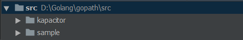

# Go 安装与入门

## 简介

Go是一门**静态类型、编译型**开发语言，具有`自动垃圾回收`，`丰富的内置类型`，`函数多返回值`，`错误处理`，`匿名函数`，`原生支持并发编程`，`反射`等特性。

- 静态类型语言是指，在声明了一个变量之后，不能改变它的类型；而动态类型语言能够随时更改其类型，背后需要运行时JVM支持；
- 编译型语言是指，在程序运行之前，需要将源代码编译成汇编语言，然后再根据软硬件环境“翻译”成机器语言（目标文件），然后再执行，一般完成编译工作的工具称为编译器；而解释型语言只有在运行时才被“翻译”成机器语言，执行一次，翻译一次。

### Go 语言的类型系统

Go 语言的接口一般只会描述一个单一的动作。

### Go 语言的内存管理

Go 语言支持自动垃圾回收机制。

### Go 语言的不足

1. 语法糖不如Python和Ruby多，开发出的代码可能不够简洁；
2. 程序运行速度还不如C，但是超过了C++和Java；
3. 第三方库还不像绝对主流的编程语言那样多，可能需要自己造轮子；

## [安装](https://golang.google.cn/dl/)

需要根据硬件架构和操作系统选择对应的版本进行下载！！！

### Linux

```shell
# 查看当前Go的版本
$ go version
go version go1.8 linux/amd64
# 如果存在老的版本，可以从当前版本升级或回退
$ go get golang.org/dl/go1.12.5
$ go1.12.5 download # 系统会将该命令最后执行时安装的版本作为当前使用的版本
# 也可以先删除当前老的版本
# 从 /etc/profile or $HOME/.profile 中查看Go的环境变量配置信息

# 下载Linux 1.12.5到本地
# 解压到 官方推荐的 /usr/local 目录下
$ sudo tar -xzvf go1.12.5.linux-amd64.tar.gz -C /usr/local
$ /usr/local/go/bin/go version
go version go1.12.5 linux/amd64
```

> 全局 /etc/profile 或者 当前用户 ~/.bash_profile

```
export GOROOT=/usr/local/go
export GOBIN=$GOROOT/bin
export GOPATH=$HOME/gopath
export PATH=$PATH:$GOBIN:$GOPATH/bin  # 追加PATH
```

在`/etc/profile`文件中添加如上信息：其中GOROOT指定Go语言安装根目录`/usr/local/go`，GOBIN为Go语言的可执行文件的目录，GOPATH为Go语言的**工作区**的集合，并且在PATH中追加`$GOBIN`和`$GOPATH/bin`。

编辑完profile文件后，使用`source`命令使设置生效：

```bash
source /etc/profile  # 或source ~/.bash_profile

go version  # 检验设置是否生效
```

### Windows

1. 下载并安装`.msi`文件；

2. 新建环境变量`GOROOT`，值为`GoLang`的安装根目录；

3. 在环境变量`PATH`属性后追加：`C:\Go\bin`；

4. 在本地新建`gopath`目录（其下包含`src`，`bin`，`pkg`目录），在环境变量中新建`GOPATH`属性，值为`gopath`目录的地址（`GOPATH`允许多个目录，当有多个目录时，使用`;`隔开，并且`go get`获取的包默认放在第一个目录下）：

   1. `$GOPATH\src`目录下存放项目源代码，不同的项目放在不同的包下面，是`Go`默认的执行`go run`、`go install`等命令的工作路径；

      

   2. `$GOPATH\pkg`目录下存放编译时生成的中间文件；

   3. `$GOPATH\bin`目录下存放编译后生成的可执行文件。

## 工作区和GOPATH

工作区是放置Go源码文件的目录，一般情况下，Go源码文件都需要放到工作区下，但是对于命令源码文件来说，这不是必须的。

当添加工作区时，只需要在系统环境变量的`GOPATH`变量后追加工作区对应的路径即可。`注：当GOPATH的值中包含多个工作区时，必须设置GOBIN，否则无法成功安装Go程序的可执行文件。`

每个工作区都包含`src`、`pkg`、`bin`三个子目录：

- `src`目录用于存放源码文件，包含若干Go Project，以代码包为组织形式；
- `pkg`目录用于存放归档文件（以`.a`为后缀的文件，`.a`前一般都是代码包的名字），所有归档文件都会被放到该目录下的平台相关目录（目录名为`${GOOS}_${GOARCH}`）中，同样以代码包为组织形式；
- 