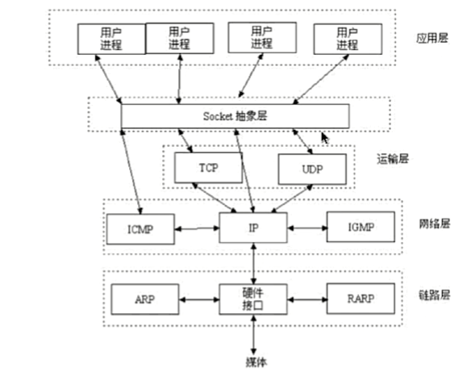
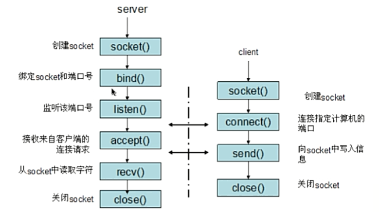

# Socket编程

Socket用于跨主机的进程间通信，使用`IP + Port`来唯一标识进程。

Socket是对TCP/IP协议的抽象，是操作系统对外开放的接口，使得开发人员更容易使用TCP/IP协议栈。



Socket起源于UNIX，遵循UNIX“一切皆文件”的设计哲学：

- Socket双方，即服务器和客户端需各自维护一个文件；
- 通信开始前，创建并打开该文件；
- 通信结束后，关闭并销毁该文件。

## Socket通信流程



## Socket相关的面试题

### 基于TCP/UDP实现Socket编程

#### 题目描述

编写一个网络应用程序，有客户端与服务器端，客户端向服务器发送一个字符串，服务器端收到该字符串后将其打印到命令行，然后向客户端返回该字符串的长度，最后，客户端输出服务器端返回的该字符串的长度，分别用TCP和UDP两种方式实现。

#### TCP实现

> LengthCalculator.java

```java
package me.yobol.socket.tcp;

import java.io.IOException;
import java.io.InputStream;
import java.io.OutputStream;
import java.net.Socket;

public class LengthCalculator implements Runnable {
    
    private Socket socket;
    
    public LengthCalculator(Socket socket) {
        this.socket = socket;
    }
    
    @Override
    public void run() {
        try {
            // 获取socket的输入流
            InputStream is = socket.getInputStream();
            int len = 0;
            byte[] buff = new byte[1024];
            // buff以byte数组的形式读取输入的内容
            len = is.read(buff);
            // 将读取的内容转换成字符串，并打印到命令行
            String content = new String(byte, 0, len);
            System.out.println(content);
            
            // 往输出流中写入获得的字符串的长度，回发给客户端
            // 获取socket的输出流
            OutputStream os = socket.getOutputStream();
            os.write(String.valueOf(content.length()).getBytes());
        } catch (IOException e) {
            e.printStackTrace();
        } finally {
            is.close();
            os.close();
            socket.close();
        }
    }
}
```

> TCPServer.java

```java
package me.yobol.socket.tcp;

import java.net.ServerSocket;
import java.net.Socket;

public class TCPServer {
	public static void main(String[] args) throws Exception {
        // 创建socket，并将socket绑定到64321端口
        ServerSocket ss = new ServerSocket(64321);
        // 死循环，使得socket一直等待并处理客户端发送过来的请求
        while (true) {
            // 监听64321端口，直到客户端返回连接信息后才返回
            Socket socket = ss.accept();
            // 获取客户端的请求信息后，执行相关业务逻辑
            new Thread(new LengthCalculator(socket)).start();
        }
    }
}
```

> TCPClient.java

```java
package me.yobol.socket.tcp

import java.io.IOException;
import java.io.InputStream;
import java.io.OutputStream;
import java.net.Socket;

public class TCPClient {
	public static void main(String[] args) {
		try {
            // 创建socket，指定连接服务器进程
            Socket socket = new Socket("127.0.0.1", 64321);

            OutputStream os = socket.getOutputStream();
            // 向服务器发送
            os.write(new String("Hello World").getBytes());

            InputStream is = socket.getInputStream();
            int len = 0;
            byte[] buff = new byte[1024];
            // 从服务器接收数据
            len = is.read(buff);
            String content = new String(buff, 0, len);
            System.out.println(content);
        } catch (IOException e) {
            e.printStackTrace();
        } finally {
            is.close();
            os.close();
            socket.close();
        }
	}
}
```

#### UDP实现

> UDPServer.java

```java
package me.yobol.socket.udp

import java.net.DatagramSocket;
import java.net.DatagramPacket;
    
public class UDPServer {
	public static void main(String[] args) {
        // 服务器端监听65001端口
        DatagramSocket socket = new DatagramSocket(65001);
        // 接收客户端发送的数据报
        byte[] buff = new byte[1024];
        DatagramPacket packetFromClient = new DatagramPacket(buff, buff.length);
        // 接收客户端发送过来的内容，并将其内容封装进DatagramPacket对象中
        socket.receive(packetFromClient);
        // 从DatagramPacket对象中获取数据
        String content = new String(packetFromClient.getData(), 0, packet.getLength());
        System.out.println(content);
        
        // 将要发送给客户端的数据转换成二进制
        buff = String.valueOf(content.length()).getBytes();
        // 向客户端发送数据报
        DatagramSocket packetToClient = new DatagramPacket(buff, buff.length, packetFromClient.getAddress(), packetFromClient.getPort());
        socket.send(packetToClient); 
    }
}
```

> UDPClient.java

```java
package me.yobol.socket.udp

import java.net.DatagramSocket;
import java.net.DatagramPacket;
import java.net.InetAddress;

public class UDPClient {
	public static void main(String[] args) {
        DatagramSocket socket = new DatagramSocket();
        // 将IP地址封装成InetAddress对象
        InetAddress address = InetAddress.getByName("127.0.0.1");
        byte[] buff = new String("Hello World").getBytes();
        DatagramPacket packetToServer = new DatagramPacket(buff, buff.length, address, 65001);
        // 发送数据报到服务器
        socket.send(packetToServer);
        
        // 接收服务器发送过来的数据报
        buff = new byte[1024];
        DatagramPacket packetFromServer = new DatagramPacket(buff, buff.length);
        socket.receive(packetFromServer);
        String content = new String(packetFromServer.getData(), 0, packetFromServer.getLength());
        System.out.println(content);
    }
}
```

## 参考

1. [socket通信处于网络协议那一层和两种接收发送消息方式](https://blog.csdn.net/jia12216/article/details/82702960)；

