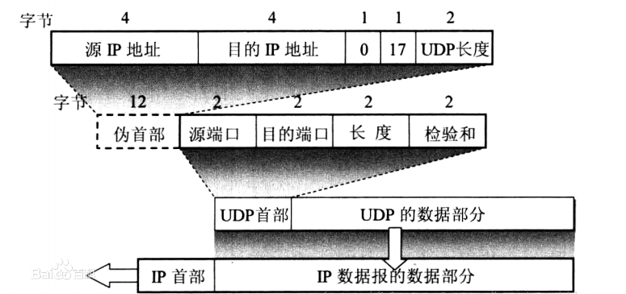

# TCP与UDP的区别

## UDP报头格式

**UDP特点：**

1. **面向无连接**：传输数据之前，通信双方无需建立连接；
2. **无需维护连接状态**，支持同时向多个客户端传输相同的消息；
3. 数据包报头只有8个字节（TCP报头为20个字节），**传输额外开销较小**；
4. 吞吐量不受拥塞控制算法的调节，只受限于数据生成速率、传输速率、传输带宽以及机器性能，**传输速度更快** ；
5. **尽最大能力交付**，不保证可靠交付，不需要维护复杂的链接状态表；
6. 面向报文，不对应用程序提交的报文信息进行拆分或者合并（TCP会对报文进行合理拆分）。

## TCP和UDP区别

|                  | TCP                                                          | UDP                                  |
| ---------------- | ------------------------------------------------------------ | ------------------------------------ |
| 是否需要建立连接 | 面向连接                                                     | 无连接                               |
| 通信形式         | 一对一                                                       | 消息的多播发布                       |
| 可靠性           | 利用握手、确认和重传机制保证传输可靠性                       | 尽最大能力交付，不保证可靠交付       |
| 有序性           | 利用序列号和确认序列号保证报文的顺序性                       | 不保证有序性                         |
| 速度             | 需要建立连接以保证可靠性和有序性，速度较慢                   | 速度较快，适用于多时间比较敏感的场景 |
| 量级             | TCP为重量级协议，报头20字节且需要一系列保障机制来保证数据的可靠传输 | UDP属于轻量级协议                    |

