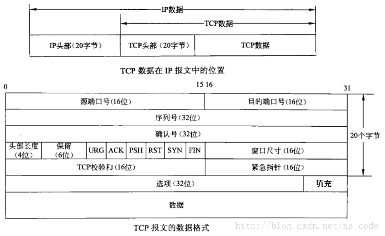
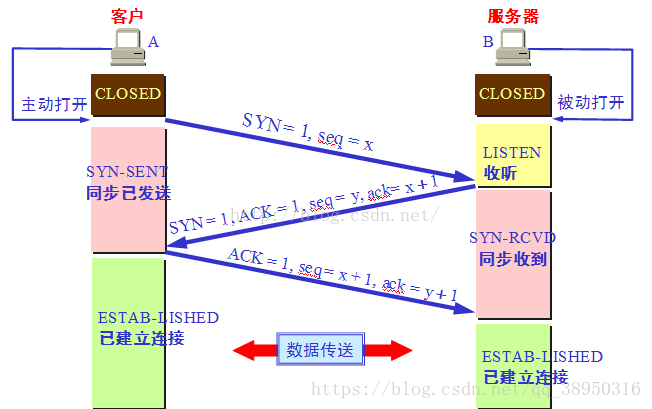

# TCP的三次握手与四次挥手

TCP是**面向连接**，**可靠传输**的协议。

面向连接是指在传输数据之前，需要先建立一条虚拟链路，以保证后续数据在这条链路上稳定可靠的传输。

可靠传输是指会对传输的数据包进行有效性校验、在数据传输超时等异常情况出现时采取重传机制、提供滑动窗口和拥塞控制机制保证在网络严苛的情况下也能最大程度地保证传输的可靠性。

## TCP报头

1. 源端口号和目的端口号各占2个字节，即16位：传输层协议都会定义这两个字段，与IP地址组合用于跨主机唯一标识进程，这种跨主机间的通信方式称为socket编程； 
2. 序列号（Sequence Number）和确认序列号（Acknowledgement Number）各占4个字节：序列号用来标记数据段的顺序，TCP把连接中发送的所有数据字节都编上一个序号，第一个字节的编号由本地随机产生，给字节编上序号后，就给每一个报文段指派一个序号，序列号seq就是这个报文段中的第一个字节的数据编号；确认序列号表示期待接收到对方下一个报文段的第一个字节的序号，因此当前报文段最后一个字节的编号+1即为确认号； 
3. 头部长度（offset）指出TCP数据距离TCP报文起始处有多远 ； 

| 字段 | 含义                                                         |
| ---- | ------------------------------------------------------------ |
| SYN  | 用于建立连接时同步序号。SYN=1，ACK=0时表示这是一个连接请求报文段；若对方同意连接，则响应报文段中SYN=1，ACK=1。 |
| ACK  | 用于对收到的数据进行确认，所确认的数据由确认序列号表示，当ACK=1时确认序列号才有效，否则确认序列号无效。 |
| FIN  | FIN=1时表示希望断开连接。                                    |

## 三次握手

### 什么是三次握手

三次握手指的是TCP建立连接时的三个步骤：

1. 发送方发出一个数据包并将SYN置1，表示希望建立请求，这个包中的序列号由发送方本地生成，假设为seq=x，然后进入SYN_SENT状态，等待服务器确认；
2. 接收方收到发送方发送过来的数据包后，通过SYN标识位得知这是一个建立连接的请求，于是发送一个SYN=1，ACK=1的响应数据包，同时确认发送方的序列号ack=seq+1并发送自己的一个序列号seq=y ，然后进入SYN_RECV状态；
3. 发送方收到接收方的响应包后进行确认，确认包中ACK=1，序列号seq=x+1，并且确认接收方的序列号ack=y+1，表示收到了来自B的SYN，此包发送完后，发送方和接收方进入ESTABLISHED状态，完成三次握手建立连接。

`注：IP协议是无连接、无状态的，且不能保证在路由器在切分数据包后有序到达目标机器。因此需要其上层协议即TCP来保证数据包的有序性，如上图所示，TCP报头中的序列号和确认序号用来保证数据包是有序的。`

### 为什么需要三次握手

建立连接需要三次握手，而不是两次主要有两点原因：

1. **确认数据的发送和接收方都有发送和接收数据的能力（信息对等）**：

   1 1 1 1 表示机器确认：自己能够发送数据 | 自己能够接收数据 | 对方能够发送数据 | 对方能够接收数据

   | ..                                | 机器A   | 机器B   |
   | --------------------------------- | ------- | ------- |
   | 第一次握手（发送方A发起请求）     | 0 0 0 0 | 0 1 1 0 |
   | 第二次握手（接收方B确认请求）     | 1 1 1 1 | 0 1 1 0 |
   | 第三次握手（发送方A再次发起请求） | 1 1 1 1 | 1 1 1 1 |

   只有三次握手才能够让接收方B确认自身有发送数据的能力，发送方A有接收数据的能力。

2. **防止请求超时导致脏连接（防止超时）**：

   一般TTL网络报文的生存时间（IP报文中定义了TTL：IP数据报在网络中最多可经过的路由器数量）都会超过TCP请求超时时间。

   如果两次握手就可以建立连接，那么双方在完成数据传输断开连接后，发送方超时的连接请求才传送到接收方，接收方将认为这是新的连接请求，并返回确认连接的响应，但是发送方并没有建立连接的意愿，所以直接丢弃了接收方的回应，导致最后只是接收方单方面建立了连接。

### 首次握手的隐患

接受方收到发送方的SYN，回复SYN-ACK的时候未收到ACK确认，接受方不断重试（重试5次，第一次等待1s，此后每次时间翻倍），Linux默认等待63s才断开连接。

可能会造成服务器受到SYN Flood攻击。攻击方向被攻击的服务器发送SYN，发送完就下线，但是服务器需要等待63s才断开连接，这样攻击者就能将服务器的SYN连接池占满，使得连接池不能处理正常的SYN请求，造成服务崩溃。

针对SYN Flood的防护措施：

1.  当服务器SYN队列满后，通过tcp_syncookies参数回发SYN Cookie；
2. 若为正常连接则Client会回发SYN Cookie，直接建立连接。

### 建立连接后，Client突然出现故障

保活机制。显然，客户端如果出现故障，服务器不能一直等下去，白白浪费资源。服务器每收到一次客户端的请求后都会重新复位这个计时器，时间通常是设置为2小时，若两小时还没有收到客户端的任何数据，服务器就会发送一个探测报文段，以后每隔75s发送一次。若一连发送10个探测报文仍然没反应，服务器就认为客户端出了故障，接着就关闭连接。

## 四次挥手

### 什么是四次挥手

四次挥手指的是TCP断开连接时的四个步骤：

1. 机器A想要断开连接，等待数据发送完毕后，发送请求断开连接（FIN置为1，seq=u为传输数据的最后一个字节的序号加上1）的数据包给机器B，随后机器A由ESTABLISHED状态进入FIN_WAIT_1状态；
2. 机器B接收到A机器发送的数据包后，通过FIN标识得知这是一个请求断开连接的请求，向机器A回应同意断开连接（ACK=1，确认序列号ack=u+1，并加上本地生成的序列号seq=v）的数据包，告诉机器A可以断开连接，但是需要自身处理完数据后，再主动给机器A发送FIN信号，随后由ESTABLISHED状态进入CLOSE_WAIT状态，机器A接收到该响应包后进入FIN_WAIT_2状态，无法再发送新的数据，但是可以接收到来自机器B的数据；
3. 在机器B发送完所有所有数据后，向机器A发送连接释放数据包（FIN=1，ACK=1，seq=w，ack=u+1），随后进入LAST_ACK状态，等待机器A的最后确认；
4. 机器A接收到机器B发送的连接释放包后，必须向机器B发送确认包（ACK=1，seq=u+1，acl=w+1），随后进入TIME_WAIT状态，等待2MSL（RFC 739标准定义为2min，Linux定义为30s）后没有接收到机器B发送的报文才正式释放连接（机器B在接收到确认包后会立即进入CLOSED状态）。

### 为什么要有TIME_WAIT状态/为什么要等待2MSL时间

MSL指一个片段在网络中最大的存活时间，2MSL就是一个发送和一个回复所需的最大时间。如果直到2MSL，Client都没有再次收到FIN，那么Client推断ACK已经被成功接收，则结束TCP连接。

原因主要是：

1. 确认被动关闭的一方能够顺利进入CLOSED状态：有可能因为网络原因被动关闭的一方无法接收到最后的ACK报文，所以会不断地向主动关闭的一方发送FIN+ACK报文，也就无法进入CLOSED状态，白白占用大量的系统资源；

### 为什么连接需要三次，而断开则需要四次

因为当Server端收到Client端的SYN连接请求报文后，可以直接发送SYN+ACK报文，其中ACK报文是用来应答的，SYN报文是用来同步的。但是关闭连接时，当Server端收到FIN报文时，很可能并不会立即关闭SOCKET，所以只能先回复一个ACK报文，告诉Client端，"你发的FIN报文我收到了"。只有等到我Server端所有的报文都发送完了，我才能发送FIN报文，因此不能一起发送，故需要四步握手。

### 服务器出现大量CLOSE_WAIT状态的原因

服务器保持大量CLOSE_WAIT状态，只有一种情况：在客户端发送FIN报文后，服务器没有进一步发送ACK报文。

即客户端关闭socket连接，服务器忙于读写没有及时关闭连接导致：

- 检查代码，可能是某些资源没能及时释放导致的；
- 检查配置，可能是处理请求的线程配置不合理导致的；

## 参考

1. [TCP的三次握手与四次挥手理解及面试题（很全面）](https://blog.csdn.net/qq_38950316/article/details/81087809)；
2. [抓包工具Wireshark的使用](https://blog.csdn.net/qq_36119192/article/details/84671638)；

