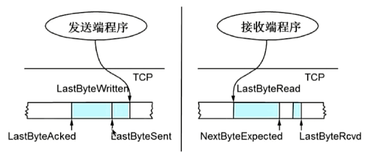
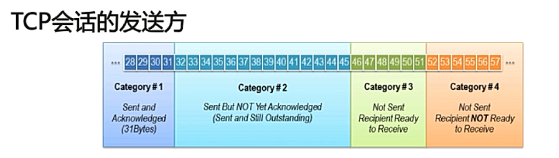
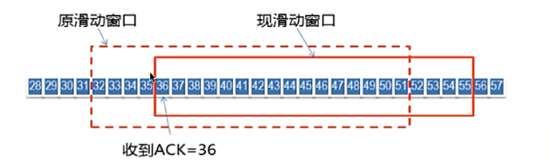
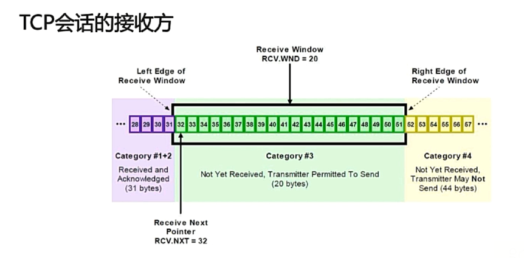

# TCP的滑动窗口

## RTT和RTO

- **RTT（Round Trip Time，即往返时延）**，是指发送一个数据包到收到相应的ACK，所花费的时间。
- **RTO（Retransmission Timeout，即重传超时时间）**，是指重传时间间隔（当发送数据包时，数据发送方会启动一个重传计数器，若在重传计时器到时之前都没有接受到接收方返回的ACK报文，则重传数据，否则重传计时器自动失效）；

`注：RTO是由RTT计算得出的。`

**参考：**

1.  [TCP中RTT的测量和RTO的计算](https://blog.csdn.net/zhangskd/article/details/7196707)
2. [TCP-IP详解: RTT和RTO的计算方法](https://blog.csdn.net/wdscq1234/article/details/52505191) 

## 滑动窗口的作用

TCP会将数据拆分成段进行传输，而将数据段依次传输效率是极低的，需要对数据进行批量发送，因此TCP必须解决可靠传输和包乱序的问题。

TCP使用滑动窗口做流量控制与乱序重排。TCP的滑动窗口主要有两个作用：

1. 保证TCP的可靠性；
2. 保证TCP的流控特性。

TCP报头中的`window`字段，用于接收方通知发送方，自己还有多少缓冲区可以接收数据，因而发送方可以根据接收方的处理能力来发送数据，不会接收方处理不过来。

**发送端：**

`LastByteAcked`指向已经被接收端确认接收的最后一个字节序号；

`LastByteSent`表明已经向接收端发出，但是还没有接收到`ACK`回应；

`LastByteWritten`指向上层应用向本地TCP缓冲区写入的最后一个字节序号。

---

**接收端：**

`LastByteRead`指向上层应用已经从本地TCP缓冲区读完的最后一个字节序号；

`NextByteExpected`指向收到的最大sequence的最后一个字节序号，还没有向发送端发送`ACK`回应；  

`LastByteRcvd`指向已经接收到并且已经向发送端发送`ACK`回应的最后一个字节序号。

---

`AdvertisedWindow = MaxRcvBuffer - (LastByteRcvd - LastByteRead)`；

`LastByteSent - LastByteAcked < AdvertisedWindow`；

`EffectiveWindow = AdvertisedWindow - (LastByteSent - LastByteAcked)`。

## 滑动窗口的基本原理

### TCP发送方

TCP发送方的TCP缓存区有四类：

- 第一类：已发送并且已接到接收方确认的；
- 第二类：已发送但是未得到接收方确认的；
- 第三类：未发送但是允许被发送的；
- 第四类：未发送并且禁止被发送的。

其中第二类和第三类缓冲区被称为**发送窗口**。

当收到接受方对于原滑动窗口字节的确认时，滑动窗口就会向后滑动。如上图所示：

- `31及之前的字节`位于第一类缓冲区，表示已经被发送并且已收到接收方确认的数据，它们位于滑动窗口之前；
- `32~35之间的字节`位于第二类缓冲区，表示已经被发送但是未得到接受方确认的数据，它们位于滑动窗口之内；
- `36~51之间的字节`位于第三类缓冲区，表示未发送但是允许被发送的数据，它们位于滑动窗口之内；
- `52及之后的字节`位于第四类缓冲区，表示未发送并且被禁止发送的数据，因为他们位于原滑动窗口之后，必须等待`32~35之间的字节`全都被确认后才能向后移动滑动窗口；

### TCP接受方

TCP接受方的TCP缓存区有三类：

- 第一类：已接收并且已发送`ACK`确认回执的；
- 第二类：未接收但是准备接收的；
- 第三类：未接受并且禁止接收的。

其中第二类被称为**接收窗口**。