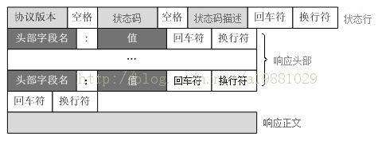
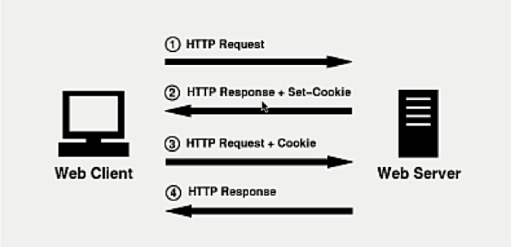
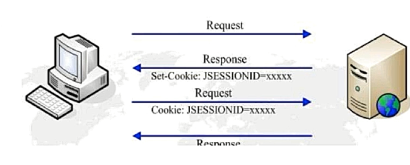

# HTTP

## HTTP简介

HTTP（Hyper-Text Transfer Protocol，即超文本传输协议）位于应用层，是一个基于请求-响应模式的无状态协议，通常运行于TCP之上。

## HTTP主要特点

- 支持C/S模式：Client向Server发送HTTP请求，Server根据请求内容向Client返回HTTP响应，通常浏览器作为HTTP Client通过URL向HTTP Server即Web Server发送所有请求；
- 简单快速：Client发送请求的时候，只需要发送请求方法和路径，常用的请求方法有`GET`，`POST`，`PUT`等；
- 灵活/媒体独立：HTTP允许传输任意类型的数据对象，使用`Content-Type`标记数据类型；
- 无连接：无连接的含义是指**限制每次连接只处理一个请求**，服务器处理完客户的请求并收到客户的应答后，即断开连接，采用这种方式可以**节省传输时间**，从HTTP 1.1开始，默认使用长连接，即服务器等待一段时间后才断开连接；
- 无状态：无状态的含义是指**对于事务处理没有记忆能力**。缺少状态意味着如果后续处理需要前面的信息，则它必须重传，可能会导致每次连接传送的数据量增大；另一方面，若服务器不需要先前信息时它的应答就较快；

`注：HTTP 1.1相较于HTTP 1.0，最大的特点是引入了Keep-Alive机制。`

## HTTP通信流程


- CGI（Common Gateway Interface）是HTTP服务器与本机或其它机器上的程序进行通信的工具，其必须运行在网络服务器上。

## HTTP请求报文结构


客户端向服务器发送的HTTP请求报文由请求行、请求头部、空行和请求数据四部分组成。

请求数据只有在请求方法为`POST`的时候才会被用到，表示要上传的数据。

空行用来标识请求头部是否结束，因而无论是否存在请求数据，请求头部后的空行都是必须的。

## HTTP响应报文结构



服务器向客户端返回的HTTP响应报文由状态行、响应头部、空行和响应正文四部分组成。

### HTTP状态码

#### **五种类型**

1. 1XX：指示信息——请求已接收，会继续处理；
2. 2XX：成功——请求已被成功接收、理解；
3. 3XX：重定向——要完成请求必须进行更进一步的操作；
4. 4XX：客户端错误——请求有语法错误或请求无法实现；
5. 5XX：服务器错误——服务器内部出现错误，不能处理合法的请求。

#### **常见取值**

可参考：[HTTP状态码100、200、300、400、500、600的含义](https://www.jianshu.com/p/760b1b579b0f)

**1XX**

| 状态码 | 状态码描述 | 解释及注意事项 |
| ------ | ---------- | -------------- |
|        |            |                |

**2XX**

| 状态码 | 状态码描述 | 解释及注意事项 |
| ------ | ---------- | -------------- |
| 200    | OK         | 正常返回消息   |


**3XX**

| 状态码 | 状态码描述        | 解释及注意事项                                               |
| ------ | ----------------- | ------------------------------------------------------------ |
| 300    | Multiple Choices  | 多项选择：针对请求，服务器可执行多种操作。服务器可根据请求者选择一项操作，或提供操作列表供请求者选择 |
| 301    | Permanently Moved | 永久性转移：被请求的资源已永久性地移除了（资源不可访问），搜索引擎在抓取新内容的同时也将旧网址A替换为重定向后的网址B |
| 302    | Temporarily Moved | 临时性转移：被请求的资源还在（仍然可以访问），此重定向只是临时地从旧地址A跳转到重定向后的网址B，搜索引擎会抓取新的内容而保存旧的网址 |

301和302状态码都表示重定向，即浏览器在接收到这两个响应码后都会自动跳转到一个新的URL地址（从首部`Location`字段中获取），只是301会在地址栏中显示新的地址，而302还是会显示旧地址。

**参考：**

1. [http状态码301和302详解及区别](https://blog.csdn.net/grandPang/article/details/47448395)；


**4XX**

| 状态码 | 状态码描述   | 解释及注意事项                                               |
| ------ | ------------ | ------------------------------------------------------------ |
| 400    | Bad Request  | 客户端请求有语法错误，不能被服务器所理解                     |
| 401    | Unauthorized | **请求未经认证**，这个状态码必须和WWW-Authenticate报头域一起使用 |
|        |              |                                                              |
| 403    | Forbidden    | 服务器能够正确理解请求，但是**拒绝提供服务**，该请求不会重发给服务器 |
| 404    | Not Found    | 请求资源不存在，eg. 输入了错误的URL                          |

> 400会在什么情况下返回？
>
> 如服务器要求请求头中Content-Type为application/json类型，但是实际传输中是以URL格式传递参数。

> 401和403有什么区别？
>
> 401 Unauthorized：表示**认证**错误，是为了认证设计，而不是为了授权设计的。**收到401响应，表示请求没有被认证**——压根没有认证或者认证不正确——但是得重新认证和重试（一般在响应头包含一个WWW-Authenticate报头域来描述如何认证）。通常由Web服务器返回，而不是Web应用。从性质上来说是临时的东西。
>
> 403 Forbidden：是关于**授权**方面的。**收到403响应，表示服务器完成认证过程，但是客户端请求没有权限去访问要求的资源。**从性质上来说是永久的东西，和应用的业务逻辑相关联。比401更具体，更实际。
>
> 总的来说，401 Unauthorized响应应该用来表示认证缺失或者错误，如账号密码错误；403 Forbidden用于认证之后，但是用户没有授权在特定资源上执行操作，即权限不够，如IP被禁。

**参考：**

1. [HTTP响应码403 Forbidden和401 Unauthorized对比](https://www.jianshu.com/p/6dceeebbde5b)
2. [HTTP Status Codes Decision Diagram – Infographic](https://www.loggly.com/blog/http-status-code-diagram/)
3. [HTTP报错401和403详解及解决办法 -- Java](https://blog.csdn.net/spicyboiledfish/article/details/78903932)
4. [400状态码示例](https://www.cnblogs.com/mengfangui/p/11505124.html)

**5XX**

| 状态码 | 状态码描述            | 解释及注意事项                                               |
| ------ | --------------------- | ------------------------------------------------------------ |
| 500    | Internal Server Error | 服务器发生了不可预期的错误，需要根据日志定位服务器出错位置   |
|        |                       |                                                              |
|        |                       |                                                              |
| 503    | Server Unavailable    | 服务器当前不能处理客户端的请求，一段时间后可能恢复正常，如TCP连接池已满 |
|        |                       |                                                              |


## 示例

**客户端请求**

```
GET /hello.txt HTTP/1.1\r\n
User-Agent: curl/7.16.3 libcurl/7.16.3 OpenSSL/0.9.7l zlib/1.2.3\r\n
Host: www.example.com\r\n
Accept-Language: en, mi\r\n
\r\n
```

**服务器响应**

```
HTTP/1.1 200 OK\r\n
Date: Mon, 27 Jul 2009 12:28:53 GMT\r\n
Server: Apache\r\n
Last-Modified: Wed, 22 Jul 2009 19:15:56 GMT\r\n
ETag: "34aa387-d-1568eb00"\r\n
Accept-Ranges: bytes\r\n
Content-Length: 51\r\n
Vary: Accept-Encoding\r\n
Content-Type: text/plain\r\n
\r\n
Response Text
```

## 请求/响应的步骤

1. 客户端连接到Web服务器（默认端口为80，也可更改为其它端口）：客户端与服务器建立一个TCP套接字连接；
2. 发送HTTP请求：客户端通过TCP连接向Web服务器发送一个文本的请求报文；
3. 服务器接收请求并返回HTTP响应：Web服务器解析HTTP请求，并定位请求资源，将资源副本写入TCP套接字返回后，由客户端读取；
4. 释放TCP连接：如果连接模式为Close，则服务器主动关闭TCP连接，客户端被动关闭TCP连接，否则若连接模式为Keep-Alive，则连接会保持一段时间，在该时间内，客户端可以直接发送请求；
5. 客户端浏览器解析响应并进行渲染。

## 常见面试题

### 1. 在浏览器地址栏键入URL并按下回车后发生了哪些事情？

1. 首先，浏览器会基于URL进行DNS（Domin Name System，是提供域名解析的应用层协议）解析：根据URL中的域名从DNS缓存（搜索顺序为：浏览器缓存 -> 操作系统缓存 -> 路由器缓存 -> IPS服务器缓存 -> 根域名服务器缓存 -> 顶级域名服务器缓存，击中后直接返回不再向后搜索）中解析出对应的IP地址；
2. 根据得到的服务器IP地址和服务器端口号与服务器建立TCP连接；
3. 浏览器向服务器发出读取文件的HTTP请求；
4. 服务器处理请求并向浏览器返回HTTP响应；
5. 浏览器解析响应并渲染页面；
6. 连接结束，释放TCP连接。

`注：5,6两步可以认为是同时发生的！`

### 2. 说说常见的HTTP状态码

200、400/401/403、500/503

### 3. GET请求和POST请求的区别

从三个方面来解答：

1. HTTP报文层面：
   - GET将请求信息放在URL中（URL与请求信息以`?`隔开，请求信息以`key=value`的形式存在，同时请求信息之间以`;`分隔），POST将请求信息放在请求体中，要获得POST请求信息必须解析请求体（解析报文非常容易，所以二者安全性并没有什么差别）；
   - 虽然URL本身对于长度没有什么限制，但是浏览器会对URL的长度进行限制，所以GET请求的数据长度是有限制的，而POST请求的请求数据是放在请求体中的，所以对请求数据的长度是没有限制的；
2. 数据库层面：
   - GET符合幂等性和安全性（GET操作用于查询操作，所以不会对数据库中的数据产生影响），POST不符合；
3. 其他层面：
   - GET请求可以被缓存、被存储（GET请求可以产生浏览记录，或者被保存为书签），而POST请求不可以。

因为GET请求是幂等的、安全的，所以可以被浏览器或CDN缓存下来，而POST请求必须交由服务器验证。

### 4. Cookie和Session的区别

HTTP协议是无状态的，所以每次访问有认证需求的资源时，都必须携带认证信息进行认证。

而引入Cookie和Session，可以让HTTP从某种意义上来说具有状态。

**Cookie**是由服务器发给客户端的特殊信息，以文本的形式存放在客户端，当客户端向服务器发送请求的时候，都会带上这些信息：

- 当用户访问一个支持Cookie（如请记住我）的网站时，在用户将用户名、密码等个人信息提交给服务器后，服务器在响应时也会将这些信息（Cookie）放在响应头（response head）中返回；

- 当客户端浏览器接收到来自服务器的响应时，浏览器会将这些信息存放在一个统一的位置；

- 当客户端再次请求时，会将这些Cookie放在请求头（request head）中进行访问；

- 服务器接收到请求后，会解析Cookie动态生成与客户端相对应的内容。

  

**Session**是一种服务端机制，存储于服务器上。当客户端向服务器为建立会话发起请求时，服务器会检查请求头中是否已包含JSESSIONID的标识，如果已包含则说明服务器与该客户端已经建立了session，服务器则会根据这个JSESSIONID检索出对应的session，如果检索不到，则再新建一个新的session，如果不包含JSESSIONID则会为该**会话请求**创建一个session，并匹配一个随机且唯一JSESSIONID，然后将该JSESSIONID回发给客户端。

Session有两种实现方式：

1. 使用Cookie实现：

   

2. 使用URL回写实现：

   服务器将在返回给浏览器的所有链接中都携带JSESSION的参数，这样点击任何一个链接，都会将JSESSIONID带回浏览器。

如果服务器发现客户端支持Cookie，则继续使用Cookie，停止使用URL回写，如果发现Cookie被禁用，则一直使用URL回写。

**二者的区别：**

1. Cookie数据通过浏览器存放在客户端上，而Session数据存放在服务器上；
2. Session相对于Cookie更安全，Cookie存储在客户端，很容易被利用；
3. Seesion将会在指定时间内存储在服务器上，并占用系统资源（存储+查询），若考虑减轻服务器负担，应当使用Cookie。

## 参考

1. [菜鸟教程 —— HTTP教程](https://www.runoob.com/http/http-tutorial.html)；