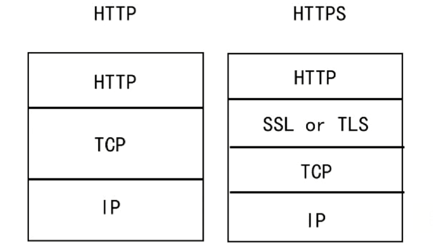

# HTTP和HTTPS的区别

## SSL

SSL（Security Socket Layer，安全套接字层）：

- 为网络通信**提供安全和数据完整性**的一种安全协议；
- 位于TCP和各应用层之间，是操作系统提供给外部的API，SSL3.0后更名为TLS；
- 采用**身份验证和数据加密**保证网络通信的安全和数据的完整性。

## 加密方式

- 对称加密：加密和解密都使用同一个秘钥；
- 非对称加密：加密使用的秘钥和解密使用的秘钥是不同的；
- 哈希算法：将任意长度的信息转换为固定长度的值，算法不可逆，如MD5；
- 数字签名：在传输的数据后加上一段哈希后的值来证明该数据是由某人发出/认同的；

## HTTPS

HTTPS（Hyper Text Transfer Protocol over SecureSocket Layer），是以安全为目标的 HTTP 通道，在HTTP的基础上通过传输加密和身份认证保证了传输过程的安全性。

和HTTP相比，HTTPS在HTTP之下，TCP之上利用SSL/TLS建立全信道，加密数据包。

`注：TLS是传输层加密协议，前身是SSL协议。`

## HTTPS数据传输过程

HTTPS在传输数据之前，会与浏览器和服务器进行一次握手，来确认双方的确认密码信息：

1. 浏览器将支持的加密算法信息发送给浏览器；
2. 服务器选择一套浏览器支持的加密算法，以证书（包含证书发布的CA机构、证书有效期、公钥、证书所有者、签名等信息）的形式回发浏览器；
3. 浏览器验证证书合法性，并结合证书公钥加密信息发送给浏览器；
4. 服务器使用私钥解密信息，验证哈希，加密响应信息回发浏览器；
5. 浏览器解密响应信息，并对信息进行验证，之后进行加密交互数据。

## HTTP和HTTPS的区别

- HTTPS需要向CA申请整数，HTTP不需要；
- HTTPS密文传输，HTTP明文传输；
- HTTPS默认使用443端口，HTTP默认使用80端口；
- HTTPS = HTTP + 加密 + 认证 + 完整性保护，较HTTP安全。

## 参考

1. [HTTP和HTTPS协议，看一篇就够了](https://blog.csdn.net/xiaoming100001/article/details/81109617)