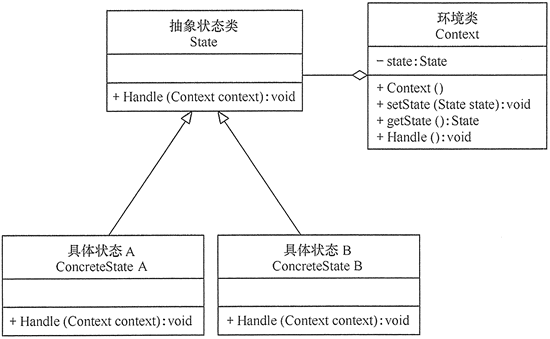
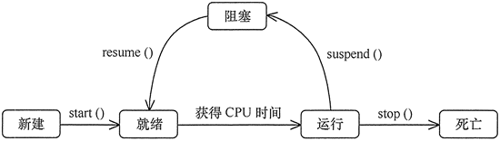
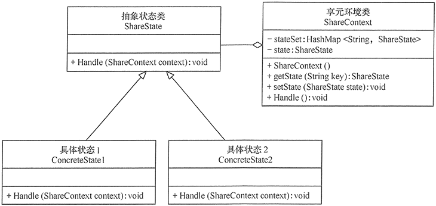

# 状态模式

在程序运行过程中，某些对象的状态根据实际情况发生改变，而这些状态的改变会影响对象作出的行为，并且状态之间是可以相互转换的。

在软件实现过程中，通常使用if-else等分支选择语句来进行状态选择，然后进行专门处理。当需要添加新的状态时，需要修改现有代码，违背了开闭原则，并且当对象拥有多个状态时，程序会变得异常复杂，代码的可读性变差，增加系统的出错概率。

使用状态模式能够很好地解决上述问题：为对象的各个状态定义一个状态类，然后将由该状态向下个状态转换的逻辑封装到类的成员方法中，各个状态当遇到相关方法调用或事件触发时会转换到其他状态。

## 定义

状态（State）模式的定义：对有状态的对象，把复杂的“判断逻辑”提取到不同的状态对象中，允许状态对象在其内部状态发生改变时改变其行为。状态模式是一种对象行为型模式。

## 优点

1. 状态模式将与特定状态相关的行为局部化到一个状态中，并且将不同状态的行为分割开来，满足单一职责原则。
2. 有利于程序的扩展。通过定义新的子类很容易地增加新的状态和转换。

## 缺点

1. 增加系统的类与对象的个数，使系统的结构与实现复杂化，如果使用不当会导致程序结构和代码的混乱（ 每个设计模式都会有这个问题）。

## 结构

状态模式把受环境改变的对象行为包装在不同的状态对象里，其意图是让一个对象在其内部状态改变的时候，其行为也随之改变。

### 角色

状态模式主要包含以下角色：

1. 环境（Context）：也称上下文，定义了客户感兴趣的接口，维护当前状态，并将与状态相关的操作委托给当前状态；
2. 抽象状态（State）：定义一个接口，封装环境对象中状态的行为；
3. 具体状态类（Concrete State）：实现抽象状态定义的行为。



## 实现

用“状态模式”设计一个多线程的状态转换程序。

分析：多线程存在 5 种状态，分别为新建状态、就绪状态、运行状态、阻塞状态和死亡状态，各个状态当遇到相关方法调用或事件触发时会转换到其他状态，其状态转换规律如下图所示。



现在先定义一个抽象状态类（TheadState），然后为每个状态设计一个具体状态类，它们是新建状态（New）、就绪状态（Runnable ）、运行状态（Running）、阻塞状态（Blocked）和死亡状态（Dead），每个状态中有触发它们转变状态的方法，环境类（ThreadContext）中先生成一个初始状态（New），并提供相关触发方法，下图是线程状态转换程序的结构图。


### Java

```java
package state;

public class ThreadStateTest {
    public static void main(String[] args) {
        ThreadContext context = new ThreadContext();
        context.start();
        context.getCPU();
        context.suspend();
        context.resume();
        context.getCPU();
        context.stop();
    }
}


//环境类
class ThreadContext {
    private ThreadState state;

    ThreadContext() {
        state = new New();
    }

    public void setState(ThreadState state) {
        this.state = state;
    }

    public ThreadState getState() {
        return state;
    }

    public void start() {
        ((New) state).start(this);
    }

    public void getCPU() {
        ((Runnable) state).getCPU(this);
    }

    public void suspend() {
        ((Running) state).suspend(this);
    }

    public void stop() {
        ((Running) state).stop(this);
    }

    public void resume() {
        ((Blocked) state).resume(this);
    }
}


//抽象状态类：线程状态
abstract class ThreadState {
    protected String stateName; //状态名
}


//具体状态类：新建状态
class New extends ThreadState {
    public New() {
        stateName = "新建状态";
        System.out.println("当前线程处于：新建状态.");
    }

    public void start(ThreadContext hj) {
        System.out.print("调用start()方法-->");

        if (stateName.equals("新建状态")) {
            hj.setState(new Runnable());
        } else {
            System.out.println("当前线程不是新建状态，不能调用start()方法.");
        }
    }
}


//具体状态类：就绪状态
class Runnable extends ThreadState {
    public Runnable() {
        stateName = "就绪状态";
        System.out.println("当前线程处于：就绪状态.");
    }

    public void getCPU(ThreadContext hj) {
        System.out.print("获得CPU时间-->");

        if (stateName.equals("就绪状态")) {
            hj.setState(new Running());
        } else {
            System.out.println("当前线程不是就绪状态，不能获取CPU.");
        }
    }
}


//具体状态类：运行状态
class Running extends ThreadState {
    public Running() {
        stateName = "运行状态";
        System.out.println("当前线程处于：运行状态.");
    }

    public void suspend(ThreadContext hj) {
        System.out.print("调用suspend()方法-->");

        if (stateName.equals("运行状态")) {
            hj.setState(new Blocked());
        } else {
            System.out.println("当前线程不是运行状态，不能调用suspend()方法.");
        }
    }

    public void stop(ThreadContext hj) {
        System.out.print("调用stop()方法-->");

        if (stateName.equals("运行状态")) {
            hj.setState(new Dead());
        } else {
            System.out.println("当前线程不是运行状态，不能调用stop()方法.");
        }
    }
}


//具体状态类：阻塞状态
class Blocked extends ThreadState {
    public Blocked() {
        stateName = "阻塞状态";
        System.out.println("当前线程处于：阻塞状态.");
    }

    public void resume(ThreadContext hj) {
        System.out.print("调用resume()方法-->");

        if (stateName.equals("阻塞状态")) {
            hj.setState(new Runnable());
        } else {
            System.out.println("当前线程不是阻塞状态，不能调用resume()方法.");
        }
    }
}


//具体状态类：死亡状态
class Dead extends ThreadState {
    public Dead() {
        stateName = "死亡状态";
        System.out.println("当前线程处于：死亡状态.");
    }
}
```

程序运行结果如下：

```
当前线程处于：新建状态.
调用start()方法-->当前线程处于：就绪状态.
获得CPU时间-->当前线程处于：运行状态.
调用suspend()方法-->当前线程处于：阻塞状态.
调用resume()方法-->当前线程处于：就绪状态.
获得CPU时间-->当前线程处于：运行状态.
调用stop()方法-->当前线程处于：死亡状态.
```

## 应用场景

1. 当一个对象的行为取决于它的状态，并且它必须在运行时根据状态改变它的行为时，就可以考虑使用状态模式。
2. 一个操作中含有庞大的分支结构，并且这些分支决定于对象的状态时。

## 扩展

在有些情况下，可能有多个环境对象需要共享一组状态，这时需要引入享元模式，将这些具体状态对象放在集合中供程序共享，其结构图如下图所示。



实现代码如下：

```java
package state;

import java.util.HashMap;


public class FlyweightStatePattern {
    public static void main(String[] args) {
        ShareContext context = new ShareContext(); //创建环境       
        context.Handle(); //处理请求
        context.Handle();
        context.Handle();
        context.Handle();
    }
}


//环境类
class ShareContext {
    private ShareState state;
    private HashMap<String, ShareState> stateSet = new HashMap<String, ShareState>();

    public ShareContext() {
        state = new ConcreteState1();
        stateSet.put("1", state);
        state = new ConcreteState2();
        stateSet.put("2", state);
        state = getState("1");
    }

    //设置新状态
    public void setState(ShareState state) {
        this.state = state;
    }

    //读取状态
    public ShareState getState(String key) {
        ShareState s = (ShareState) stateSet.get(key);

        return s;
    }

    //对请求做处理
    public void Handle() {
        state.Handle(this);
    }
}


//抽象状态类
abstract class ShareState {
    public abstract void Handle(ShareContext context);
}


//具体状态1类
class ConcreteState1 extends ShareState {
    public void Handle(ShareContext context) {
        System.out.println("当前状态是： 状态1");
        context.setState(context.getState("2"));
    }
}


//具体状态2类
class ConcreteState2 extends ShareState {
    public void Handle(ShareContext context) {
        System.out.println("当前状态是： 状态2");
        context.setState(context.getState("1"));
    }
}
```

程序运行结果如下：

```
当前状态是： 状态1
当前状态是： 状态2
当前状态是： 状态1
当前状态是： 状态
```