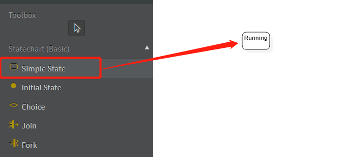
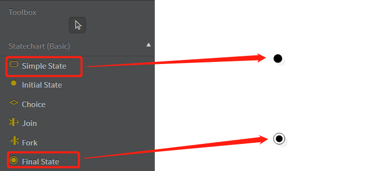
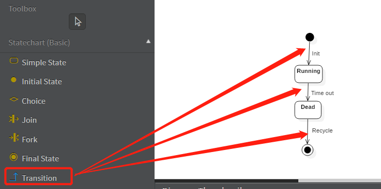

# 状态图与状态机

1. 本文主要介绍了状态图的基本元素，并借助Linux进程的例子讲解了如何使用状态图进行状态机建模。
2. 本文中的状态图使用[StarUML](http://staruml.io/) v3.1.0构建，建立状态图步骤：Top Menu -> Model -> Add Diagram -> Statechart Diagram。

## 状态图简介

状态图主要用于描述一个对象在其生存期间的动态行为，表现为一个对象所经历的状态序列，引起状态转移的事件（Event），以及因状态转移而伴随的动作（Action）。一般可以用状态机（State Machine）对一个对象的生命周期建模，状态图用于显示状态机，重点在于描述状态图的控制流。

## 什么情况下需要状态图

1. 当功能行为的改变和状态有关时，这种情况下使用状态图可以显示对象在其声明周期中依次经历的各种状态。

## 状态图的作用

1. 研究类、角色、子系统或组件之间的复杂行为；
2. 建模实时软件应用系统。

## 状态图元素（State Diagram Elements）

### 状态（State）

状态是指**某一时刻对象所处的状况**。当某个事件或动作发生后，对象的状态会发生变化，状态的转换通常是连贯的，即对象在某一时刻的状态都是一系列活动的结果。状态图中状态用**圆角矩阵**表示。

除了中间状态，还有两个特殊的状态，即初态和终态。初态使用实心圆表示，终态使用空心圆内嵌圆点表示。

初态是状态图的起始点，终态是状态图的终点，在一个状态图中只允许存在一个初态，而可以存在多个终态。

### 转移（Transition）

转移描述了从原状态到目标状态的转换关系。

当原状态和目标状态为同一个状态时，转移可称为自我转移（Self-Transition）。

## 状态图实战

下面以**Linux进程**为例，展示如何使用UML状态图对Linux进程的生命周期进行建模。

## 参考

1. [UML建模之状态图（Statechart Diagram）](https://www.cnblogs.com/ywqu/archive/2009/12/17/1626043.html)。
2. [Linux中进程的几种状态](https://www.cnblogs.com/klb561/p/11945157.html)

