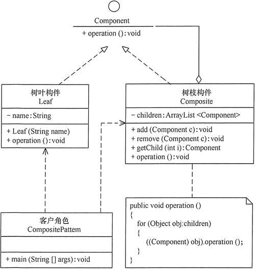

# 组合模式

组合（Composite）模式也叫“**整体-部分**“模式，可以用来处理诸如文件夹（整体）与文件（部分）、容器控件与简单控件等**复合对象和简单对象**的关系。

## 定义

组合模式是一种**将对象组合成树状结构的模式，用来表示“整体-部分”的关系，使用户对复合对象和简单对象具有一致的访问性**。

## 优点

1. 使得用户可以一致地处理复合对象和简单对象，无须关心自己处理的是还是复合对象还是简单对象，可以简化用户代码；
2. 当向组合体内加入新的元素时，可以不用修改现有代码，满足“开闭原则”，即增删节点更加自由；

##  缺点

1. 设计较复杂，开发者可能需要更多精力维护和理解类之间的层次关系；
2. 复合对象和简单对象都声明为实现类，违反了“依赖倒置”原则；
3. 不容易用继承的方法来增加构件的新功能；

## 结构

### 角色

组合模式主要包含以下角色：

1. **抽象构件（Component）**：主要作用是为树叶构件和树枝构件定义公共接口，并实现其默认行为。在透明式组合模式中抽象构件还声明访问和管理子类的接口，在安全式组合模式中则不声明，管理工作由树枝构件完成；
2. **树叶构件（Leaf）**：是组合中的叶节点对象，没有子节点。通常只需要实现抽象构建定义的`Operation(Object o)`方法；
3. **树枝构件（Composite）**：是组合中的分支节点对象，有子节点。它的主要作用是存储和管理子部件，因此除了需要实现抽象构建定义的`Operation(Object o)`方法，还通常包含 `Add(Component c)`、`Remove(Component c)`、`GetChild(Object key)` 等方法。

### 类型

组合模式分为**透明式**组合模式**安全式**组合模式。

#### 透明式

树叶构件除了需要实现定义个体行为的`Operation()`方法之外，同样需要实现`Add()`、`Remove()`及`GetChild()`方法，因此树叶构件和树枝构件对于客户角色来说是透明的。

**缺点：**树叶构件本来没有`Add()`、`Remove()`及`GetChild()`方法，却要实现它们（空实现或抛异常），这样会带来一些安全性问题。


#### 安全式

在该方式中，将管理子构件的方法移到树枝构件中，抽象构件和树叶构件没有对子对象的管理方法，这样就避免了上一种方式的安全性问题，但由于树叶构件和树枝构件有不同的接口，客户角色在调用时要知道树叶对象和树枝对象的存在，所以失去了透明性。



## 实现

假如要访问集合 c0={leaf1, {leaf2 ,leaf3}} 中的元素，其对应的树状图如下图所示。


下面给出透明式的组合模式的实现代码，与安全式的组合模式的实现代码类似，只要对其做简单修改就可以了。

### Java

```java
package composite;

import java.util.ArrayList;

//抽象构件
interface Component {
    public void add(Component c);

    public void remove(Component c);

    public Component getChild(int i);

    public void operation();
}

//树叶构件
class Leaf implements Component {
    private String name;

    public Leaf(String name) {
        this.name = name;
    }

    public void add(Component c) {
    }

    public void remove(Component c) {
    }

    public Component getChild(int i) {
        return null;
    }

    public void operation() {
        System.out.println("树叶" + name + "：被访问！");
    }
}


//树枝构件
class Composite implements Component {
    private ArrayList<Component> children = new ArrayList<Component>();

    public void add(Component c) {
        children.add(c);
    }

    public void remove(Component c) {
        children.remove(c);
    }

    public Component getChild(int i) {
        return children.get(i);
    }

    public void operation() {
        for (Object obj : children) {
            ((Component) obj).operation();
        }
    }
}

public class CompositePattern {
    public static void main(String[] args) {
        Component c0 = new Composite();
        Component c1 = new Composite();
        Component leaf1 = new Leaf("1");
        Component leaf2 = new Leaf("2");
        Component leaf3 = new Leaf("3");
        c0.add(leaf1);
        c0.add(c1);
        c1.add(leaf2);
        c1.add(leaf3);
        c0.operation();
    }
}
```

程序运行结果如下：

```
树叶1：被访问！
树叶2：被访问！
树叶3：被访问！
```

### Golang

## 应用场景

1. 在需要**表示对象整体与部分的层次结构**的场合；
2. 要求对用户隐藏组合对象与单个对象的不同，用户可以用统一的接口使用组合体中的所有对象的场合。

## 扩展

如果对前面介绍的树叶节点和树枝节点进行抽象，也就是说树叶节点和树枝节点还有子类，这时组合模式就扩展成复杂的组合模式了，如AWT/Swing 中的简单组件JTextComponent 有子类JTextField、JTextArea，容器组件 Container也有子类 Window、Panel。复杂的组合模式的结构图如下图所示。


## 参考

1. [组合模式（详解版）](http://c.biancheng.net/view/1373.html)
2. [Golang组合设计模式](https://blog.csdn.net/weixin_40165163/article/details/90734545)